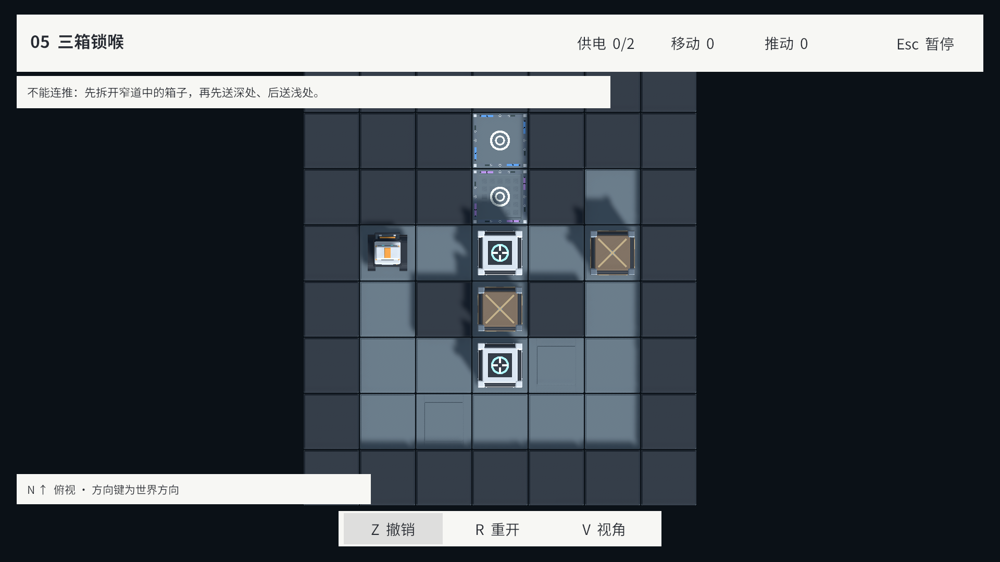
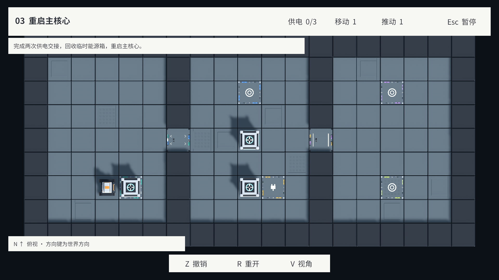

# 空间站套件游戏接入

2026-09-16（America/New_York）完成首批 11 个资产的 `BoardView` 接入。2026-09-17 的 [v0.2.0](../Versions/V0.2.0.md) 按 [确认的视觉方案](VisualReadabilityReview.md) 更新插槽、连线与门标牌。
正式关卡、编辑器试玩和 GM/现场编辑重建都使用同一表现实现。并行 v0.2.1 将正式目录调整为 L04–L06；视觉迭代不修改关卡 JSON、参考解法及 Domain 规则。

## 入口与外观

- 打开 `Assets/Scenes/Bootstrap.unity`，进入 Play Mode，按原主菜单流程开始或选关。
- [运行时主题配置](../../Assets/Resources/configs/StationKitTheme.asset) 显式引用 11 个 Prefab、材质、字形 Mesh 和已有字体，保证 Player 构建保留依赖。
- 三种地板采用稳定、稀疏的格坐标分布；墙体按邻接关系选择直段、转角、端头并旋转。T/十字仍是完整实心墙格。
- 两类箱子由 `CrateDefinition.kind` 选择，不以颜色、灯光或所在格推断类型。推动接口和动作时序不变。
- 低摩擦格复用新地板，加固定蓝灰涂装和原有条纹标记；格栅地板仍是普通 Floor。

## 来源身份与状态

`StationKitTheme.bindings` 继续提供稳定的来源短标签。运行时采用统一中性色与电力强调色，不再要求记忆五种边条颜色；旧样式配置和资产保留，隔离资产展示仍可使用。

- 目标环/外角标只由 `isGoal` 决定；插头只在该插槽被某扇门引用时显示。纯目标 B 没有插头，目标电源 A 同时显示环和插头，辅助电源 S 只有插头。
- `StationCircuitLayout` 按门 ID 排序分配 G1/G2，按真实来源关系生成布线；输入数组重排、移动、撤销或相同数据重建不会改变编号。
- `StationCircuitView` 替换运行时实例的旧插槽标记和微型来源标牌，保持导入模型与 GUID。功能格使用普通底板；`StationCircuitMesh` 生成可复用的平面图形，不加载概念图片。
- 布线绕开墙和 Void，优先绕开无关插槽。窄道必须经过无关目标时走边缘，既不增加该目标的插头，也不在其中心制造连接点。物理不连通的作者地图保留来源编号，不伪造穿墙电线。

三路信号分别处理：

| 信号 | 驱动 |
| --- | --- |
| `PowerState.Sockets` | 插槽状态条、该来源所有分支的虚线/实线及各门标牌中的空心/实心状态点 |
| `PowerState.PoweredGates` | 门的电源条件灯 |
| `PowerState.OpenGates` | 门板姿态、通行地标、相机遮挡代理 |

因此普通箱占槽不亮灯；普通箱占门、机器人接替占门时可以门开而灯灭。
Any/All 来自现有 `GateDefinition.powerMode`，显示为“任一/全部”。屏幕标牌为每个来源保留独立的空心/实心点；无供电却因占据保持开启时另标“占据保开”。
超过四路时常态显示通电数量，指向/靠近后展开来源；超过八条连接的地图聚焦显示，避免铺满所有线路。超大自定义网络的显示密度仍需专项易用性评估。

每个棋盘持有四份标记材质和复用 Mesh，状态切换复用它们，销毁棋盘时释放。材质使用主题显式引用的 URP/Unlit 裁切变体与白贴图，不通过 Shader.Find 猜测构建依赖。能源箱窗口和普通箱外观保持原状。
标牌使用 Noto Sans SC、无交互射线的独立 Canvas，在 Cinemachine 更新后投影；字号按屏幕尺寸保持 14–20 px。它们避开主要功能图案、箱子与 HUD，并在移到侧边时显示短引线。跟随视角进行墙体遮挡检查；标牌本身不随门旋转。

## 动画、相机与恢复

- 门采用已交付的双段上收姿态，默认 0.18 秒，可通过主题调整；不缩小门板或移动资产根。
- 暂停、导航遮盖、GM 动画暂停统一冻结门动画。撤销、重开、重建、卸载取消旧 Tween，并直接恢复目标姿态与全部状态灯。
- 普通动作结束后允许门的短动画完成；新指令开始时使上一过渡收敛到已确认状态，避免下一次通行穿过尚未收起的门板。
- 俯视隐藏墙上部、门柱上部、收纳区和门板；保留基座，显示新的两侧端点与开/关地标，标牌保持屏幕正向。
- 墙和关闭门的 BoxCollider 仅用于现有 Cinemachine 避障。隐藏 Renderer 不改变碰撞代理或逻辑占格；箱子/插槽不添加物理驱动。

## 维护与验证

当前简约图形、布线和标牌的验收见 [v0.2.0 实现报告](../History/08-CircuitReadability/ImplementationReport.md)：EditMode 3/3、PlayMode 41/41，包含当前三关完整参考解法与九张实机画面。下面的表格和截图保留首次套件接入时的历史结果。

首次接入的生成入口为 `Tools > Station Kit > Prepare Gameplay Integration`。
已有主题的 Prefab、调色板和来源绑定不会被重建覆盖；该入口会补缺失的文字材质引用并校正主题发光标志。
Blender/FBX 的重新制作与资产验收仍沿用 [原生产说明](../../ArtSource/StationKit/README.md)。

| 验证 | 结果 |
| --- | --- |
| 完整项目 PlayMode | [37/37 通过](../History/07-StationKitIntegration/Validation/StationKitGameplayTests.json)，包括六关原参考解法、菜单、GM、现场编辑、滑行、取消与暂停 |
| 文字深度修复后定向复测 | [8/8 通过](../History/07-StationKitIntegration/Validation/StationKitLabelRetest.json)，覆盖新套件、两类箱子、门状态、俯视、重建清理和 Esc 输入 |
| 实际关卡画面 | L05 北向俯视、L06 跟随视角、L03 多路连接及真实推动后的开门状态 |
| 构建与 Console | 见 [本轮汇总](../History/07-StationKitIntegration/Validation/StationKitIntegration.json) |

首轮测试包含旧白模节点名断言失败，现已改为检查交付资产的稳定节点。
同轮 Esc 输入用例出现一次失败，随后单项和完整回归均通过；未为此修改 UI 输入逻辑。
结果文件记录实际运行范围，不将资产演示夹具当作正式关卡回归。

