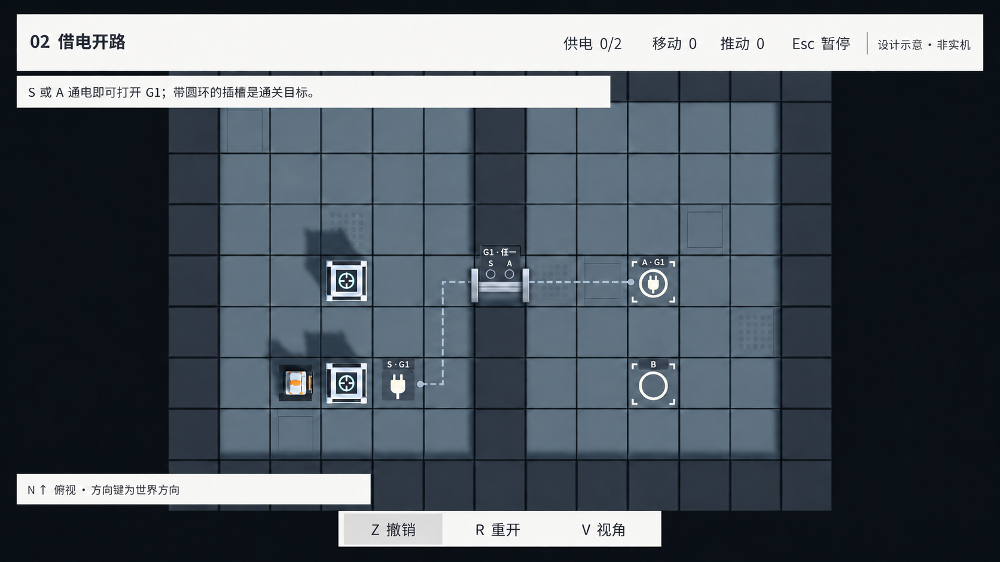
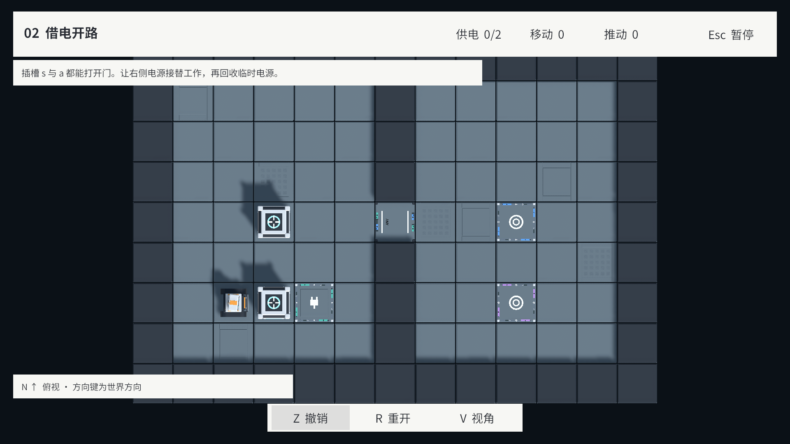
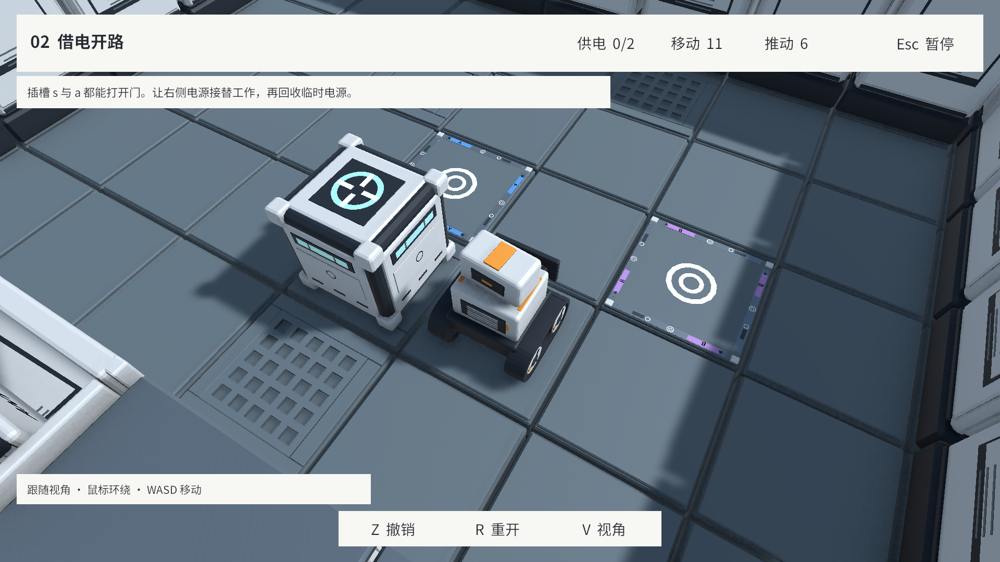
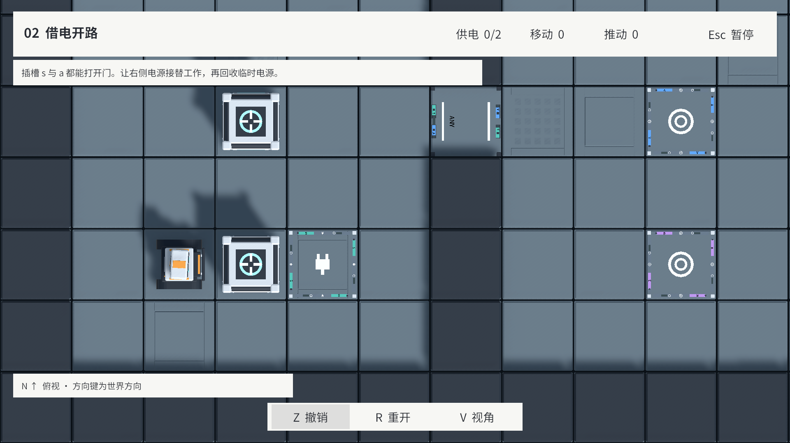
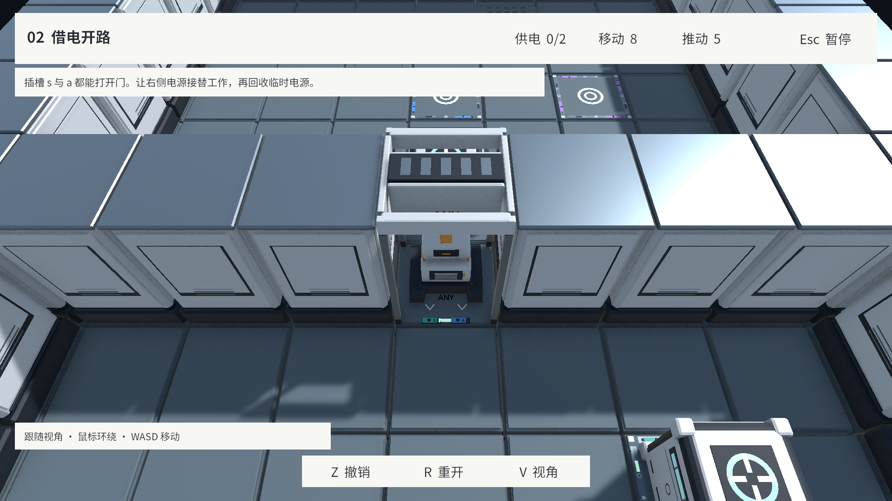
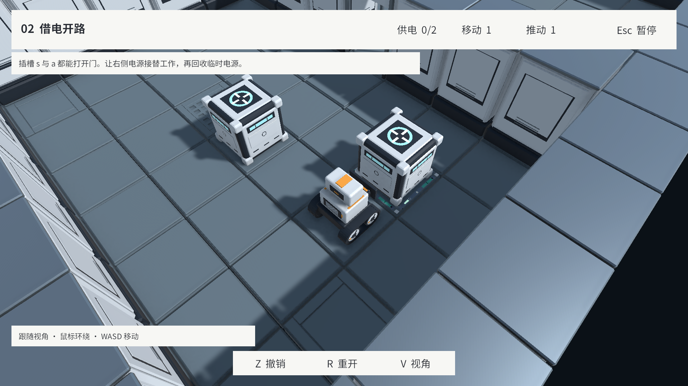
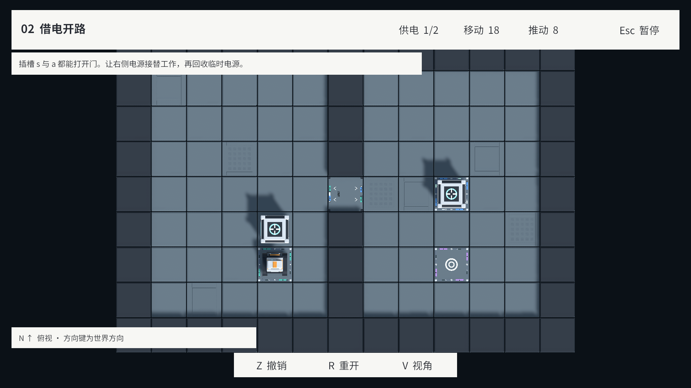
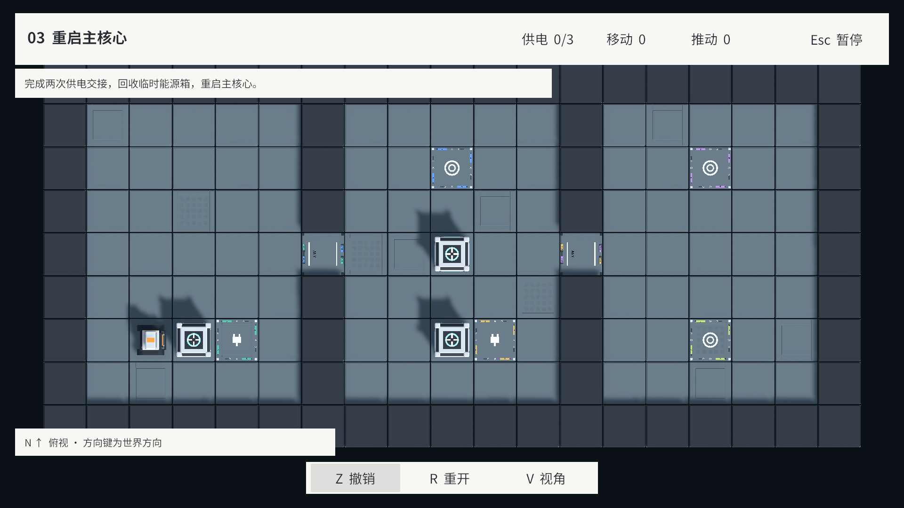

# 插槽、目标与受电门：视觉可读性审查及改进方案

原审查日期：2026-09-16（America/New_York）。原审查仅交付问题归纳与实机截图。2026-09-17 按用户确认的修正图更新方案，进入 [v0.2.0 实现](../Versions/V0.2.0.md)；下方原始截图保留为修改前证据。

上图是设计概念，不是 Unity 实机。插头含义已收紧为“给门供电”，替代初稿的“所有插槽均显示插头”；B 的中心插头已移除。

**实现已完成：** [v0.2.0 实机画面与验收报告](../History/08-CircuitReadability/ImplementationReport.md)。下方旧截图与问题分析作为修改前证据保留。

**建议先在 Unity 内完成视觉信息重排，以俯视全图为首要验收画面。当前证据不支持把重做 Blender 模型作为前置条件。**

## 1. 对齐问题

| 问题 | 玩家需要知道的事 | 当前缺口 |
| --- | --- | --- |
| 双重用途不明确 | 这个位置既是通关目标，也能给某扇门供电 | 目标 A 与不连接门的目标 B 使用相同同心圆；插头图案只出现在辅助插槽上 |
| 多来源关系不明确 | 哪些插槽控制同一扇门；任意一个即可，还是必须全部通电 | 主要依赖门边的小色条、字母和 ANY/ALL；常规玩家画面没有连接线 |
| 俯视信息不足 | 缩到整张棋盘时仍能读懂用途、连接、当前状态 | 俯视主要隐藏模型上部；标牌仍是很小的世界尺寸，文字随门旋转，没有独立的信息布局 |
| 占据后提示变弱 | 箱子盖住插槽时仍能知道它是目标、给哪扇门供电 | 中心图案被箱子覆盖；剩余边条和小灯难以承担全部信息 |

术语澄清：规则中所有目标点都是 `PowerSocket`，`isGoal` 表示是否计入通关；“能否开门”由门的 `sourceSocketIds` 决定。视觉上只编码两个独立职责：**目标环 = 通关目标；插头 = 门的电源来源**。仅为目标的 B 不画插头；A 同时画环和插头。此约定不改变 B 仍需能源箱供电的逻辑。

## 2. 实际截图与定位

七张图片均为本轮 Unity 2022.3.51f1 的 Play Mode Game View 截图，1920×1080，保留实际 HUD，无 GM 连接叠加、无后期标注或重绘。使用当前正式关卡与真实规则可达局面；相机参数在现有玩家可调范围内。

### A. 第二关：同图案、不同职责

- 右侧上方蓝边 A `(9,4)`：目标 + `gate_01` 电源。
- 右侧下方紫边 B `(9,2)`：目标，不连接任何门。
- 左下青绿边 S `(4,2)`：辅助插槽 + `gate_01` 电源。
- 中央门 `(6,4)`：`Any [S,A]`。

A 与 B 的大图案都是同心圆。颜色和字母表达来源身份，但没有明确表达 A 还负责开门。S 的插头反而容易让人误以为只有这类格子具有供电功能。

近看仍然存在语义缺口：画面上方的 A、右下的 B 都是圆环，差异主要在边条配色。A 前方箱子还会遮住部分中心图案。此图为合法路径 `ENWNEEEEESE` 后，玩家 `(8,3)`；S 通电，A/B 尚未通电。

### B. 第二关：门的多路输入

同一初始局面，只把正交尺寸从 5.5 缩到 3.1。即使放大，门的 S/A 来源仍挤在两侧细条内；`ANY` 随朝东的门旋转了 90°。关闭状态的两条白线也没有强烈的“此路不通”轮廓。全图下这些细节会进一步缩小。

第 8 步 `ENWNEEEE`：S 通电，A 未通电，门已开启，机器人位于门格。近处能看到门边 S/A 和 ANY，说明数据已经接入表现；问题是信息层级与尺度。门框、收纳结构和角色也会参与遮挡。

### C. 供电交接与遮挡

第 1 步 `E` 后 S 通电。能源箱覆盖中心插头，主要剩下窄边缘与小灯；目标槽被占据时也有相同问题。

第 18 步 `ENWNEEEEEEWWWSSSWN`：S 已断电，A 通电，B 未通电，门继续开启。这直接证明“目标也能接替开门”的机制有效，但 A 的目标图案已被箱子盖住，门边微小灯光变化难以解释供电来源的交接。

### D. 第三关：更多连接进一步增加认读成本

- 第一扇门 `(6,4)`：`Any [S(4,2), A(9,6)]`。
- 第二扇门 `(12,4)`：`Any [T(10,2), B(15,6)]`。
- C `(15,2)` 只计入通关，不控制门。

五种边条配色、多个圆环和两组微型标牌需要玩家自行匹配；没有贯通的视觉关系。A/B/C 大图案相同，其中 C 又落在格栅地板上，功能标记与底板细节混在一起。

截图索引、相机参数、命令序列和文件哈希见 [VisualReadabilityEvidence.json](VisualReadabilityEvidence.json)。截图覆盖正式关卡的 Any 双来源；All、多于两路及一源多门没有在本轮实机截图中验收。

## 3. 原因与资产判断（修改前）

此表记录原审查时的代码行为；链接处的当前代码已经加入 v0.2.0 的修正。

| 证据 | 对改进方式的影响 |
| --- | --- |
| [BoardView.cs](../../Assets/Scripts/Presentation/BoardView.cs) 仅按 `socket.isGoal` 选择 GoalSocket/UtilitySocket；随后配置身份与灯光 | 插槽外观没有根据“被哪些门引用”生成额外提示；Unity 表现层即可补齐 |
| [模型生成源](../../ArtSource/StationKit/scripts/build_station_kit.py) 为目标生成 `TypeMarker/TargetRings`，为辅助生成 `TypeMarker/PlugSymbols` | 两种符号是互斥选择。可在 Unity 中禁用旧 TypeMarker，组合新的插头和目标外环，避免叠上第三套装饰 |
| [StationGateView.cs](../../Assets/Scripts/Presentation/StationGateView.cs) 的来源字高参数为 0.041，地面模式文字为 0.085，并继承门的旋转 | 需要按最终屏幕尺寸安排标记，不宜只增加发光强度或整体缩放门模型 |
| [BoardView.SetTopDown](../../Assets/Scripts/Presentation/BoardView.cs) 与 [StationGateView.SetTopDown](../../Assets/Scripts/Presentation/StationGateView.cs) 主要控制上层 Renderer 可见性 | 当前俯视模式缺少专门的信息呈现；应在 Unity 内增加 |
| [GmOverlay.cs](../../Assets/Scripts/Presentation/GmOverlay.cs) 才有 ShowLinks，且受 Editor/Development 条件编译控制 | 调试连线不能作为正式玩家方案；连接关系需要独立、可随 Player 构建交付的表现 |
| [Station Kit 接口](../../ArtSource/StationKit/README.md) 已分出 TypeMarker、LinkMarkers、PowerStatus、TopDownMarkers 和来源标牌 | 图形、身份、状态与主体几何已有分离点，可保留现有机器人、箱子、门机构和资源 GUID |

## 4. 推荐的简约视觉语言

### 4.1 用可组合标记表达三个职责

| 元素 | 推荐表达 | 是否随通电改变 |
| --- | --- | --- |
| 门的电源来源 | 只有被门引用的插槽显示清晰、较大的插头图形 | 关系存在时图形始终保留 |
| 通关目标 | 插槽增加一圈醒目的目标外环，辅以占据后仍露出的角标 | 未完成保留轮廓，完成增加填充/亮度 |
| 控制某扇门 | 格边保留短连接端口和 `G1`/`G2` 门编号；无门连接则不显示 | 关系标记始终可见 |
| 当前供电 | 短状态条由空心变实心，配合统一电力强调色 | 只由真实插槽电力驱动 |

对应第二关：S = 插头 + G1；A = 插头 + 目标环 + G1；B = 目标环。没有被门引用、也不是目标的作者插槽只保留中性底座和标签，不伪造门电源身份。这样 A 同时承担两项任务，不必靠玩家从颜色猜测。

目标环不能只留在格子中心：能源箱占地约 0.8 m，外围目标角标、门编号和状态条应在占据时仍可见的位置，或由屏幕标记补充。普通箱压住插槽时只表示“占据”，不能点亮供电状态。

减少重复：四边的一串微型符号、来源字母、形状、细灯不再全部并列。常态每格保留一个主图形、一组边缘功能提示；装饰线条降对比。颜色主要帮助区分通电，身份依赖稳定编号和形状，不要求记住五种颜色。

### 4.2 让“谁连谁”和“满足什么条件”分开读

1. 给门固定短编号 G1/G2，并在其来源插槽上重复对应编号。编号按稳定 ID 配置/生成，不随列表顺序、撤销或重建变化。
2. 俯视常态显示低对比细连接线，沿格边走线；每条源分支保持独立，通电的分支变实线/高亮。没有连接的 B/C 不画线。连线交叉处用跨线或断口，不能画成暗示电路相连的节点。
3. 门边用一块简短、朝屏幕正向的标记显示来源与条件，例如 `G1 · S / A · 任一`；All 则显示 `G1 · S + A · 全部`。两个独立来源状态点仍然存在，不把“一路满足条件”误画成“所有来源均已通电”。
4. 靠近、指向或选择门/插槽时，突出整组关系，补充 `已供电 1/2 · 需要 1` 之类的完整说明。键盘跟随视角也要有靠近触发，不能只依赖鼠标悬停。

当前正式关卡均为 Any，但编辑器支持 All。一源多门时在来源边缘列出多个门编号并绘制独立分支；复杂自定义网络默认聚合，选中后展开，避免把所有连线与标签永久堆满棋盘。门分组颜色不能覆盖插槽的稳定来源身份。

### 4.3 俯视单独设计，仍与同一逻辑状态同步

- 关闭门：保留醒目的横向阻挡条/封闭图形，沿实际通行方向表达阻挡；开门：改为两侧端点和清晰空出的中央通道。
- 门编号、Any/All 条件与来源状态采用屏幕正向标记。门的几何朝向保持原样，文字不再跟着转 90°。
- 中心图形用于快速认类别；连接提示与状态条按最小屏幕像素尺寸保护，不随正交缩放一路缩成噪点。作为首轮调参目标，可从 1080p 全图文字约 16 px、主图形至少 24 px 开始，在实际 720p 下复核，避免固定世界字号。
- 标记进行位置避让，不压在箱子、机器人或 HUD 下。目标占据后保留外围角标；详细连线在复杂地图上按聚焦逐组展开。
- 插槽地面优先用干净底板，避免把格栅/维修缝作为功能图形背景；降低无关微细线条和强反光的存在感，保留空间站整体风格。
- `Sockets`、`PoweredGates`、`OpenGates` 继续分别驱动插槽电力、门电源条件和通行图形。门被普通箱或机器人占据而保持开启时，必须能显示“可通行但无供电”。

## 5. Unity 与 Blender 的分工

| 工作 | 推荐位置 | 理由 |
| --- | --- | --- |
| 组合“插头 + 目标环 + 连接端口” | Unity Prefab/可复用平面图形 | 既有 TypeMarker 可独立替换；双重身份由关卡数据决定 |
| 门编号、来源关联、连接线、Any/All、状态反馈 | Unity 运行时表现 | 随任意关卡、占据和供电变化，无法靠固定 FBX 正确表达 |
| 俯视标签、最小屏幕尺寸、遮挡避让、开关门地标 | Unity 相机与表现层 | 属于镜头和信息布局问题 |
| 减少装饰标记、替换功能格底板、调整对比和材质 | 优先 Unity 主题与 Prefab | 可快速在实际关卡 A/B 对比，保留现有主体资产 |
| 重做底座轮廓、门框体积，删除合并在主体 Mesh 中的装饰，优化实体插座凹槽 | 确有需要时 Blender | 这类属于几何结构；应在第一轮引擎内验证后再决定 |

**本轮建议：先做 Unity 方案验证，不新增“目标兼插槽”专用 FBX。** 如果验证后确认现有门顶体积或底座细节仍严重干扰，再回 Blender 局部减法；保留编辑源、导出接口与 GUID。单纯重新建模不能解决关系、条件、缩放和占据遮挡。

## 6. 后续实施与验收方案

1. **先验证三种身份。** 在现有模型上组合功能标记，隐藏被替代的旧标记；同时完成门的清晰开/关地标。当前正式目录已由并行 v0.2.1 调整为 L04–L06，用 L06 与独立 S/A/B 测试局面对比，不恢复已移除的关卡资源。
2. **再验证连接与交接。** 门编号根据稳定 ID 排序，加入分支连线、来源状态和条件提示；在 S 开门 → A 接替 → 移走 S 三个状态复核。处理俯视标签朝向、最小尺寸和占据避让；窄道经过无关目标时沿边缘布线，不在其中心增加端口。
3. **最后决定几何减法。** 只有仍影响识别的合并网格细节进入 Blender 修改。之后才做常规资产导出/导入复验。

验收应能直接回答以下问题：

- 不读关卡说明，在全图画面中指出哪个目标也能开门，哪个目标不控制门。
- 指出 S/A 同属 G1，以及 T/B 同属 G2；明白 Any 只需一路、All 需要全部。
- 箱子盖住 A 后仍能识别目标身份与 G1 连接；移走 S 后能够看出 A 在接替供电。
- 不把普通箱占槽当成通电；不把占据保门的“开着”当成“有电”。
- 1920×1080、1280×720，跟随近/远机位、默认全图俯视/放大俯视、灰阶检查中均可辨认；标签不随门旋转、被 HUD 遮挡或互相叠压。
- 后续脚本变更需等 Unity 编译并检查 Console；针对 Station Kit 状态同步、Any/All、一源多门、普通箱占据、撤销/重开和视角切换运行相关 PlayMode 测试。自动断言通过之后仍需人工看图，不能代替可读性判断。

原审查已逐张查看七张截图，核对当时的正式关卡数据和实际电力状态；原审查操作前后 Console 均为 0 条错误。上面的旧画面不是新方案的验收记录。v0.2.0 的实现结果、测试和新截图以 [版本计划](../Versions/V0.2.0.md) 为准。
