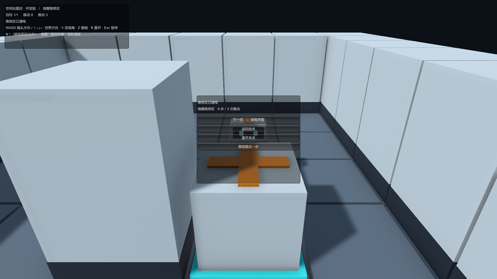
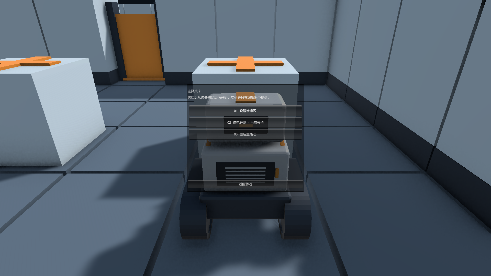

# 第二轮：通关继续与选关

阶段：02-CampaignFlow · 日期：2026-09-16。

本页保留该轮实现、验证与限制；当时的“当前”及待办以该轮为准。最新范围见 [当前实现状态](../../ImplementationProgress.md)，阶段顺序见 [文档索引](../../README.md)。

触发：第一关通关后仅有“重开本关”和“撤销最后一步”，无法进入下一关。首轮并未实现关卡串联。

- `CampaignCatalog.asset` 按顺序引用 L01、L02、L03；目录读取校验结构、空引用与重复 ID，LAB01 默认不进入列表。
- L01/L02 结算新增“下一关”和“返回选关”，并显示本局移动/推动统计。L03 显示“空间站已重启”，没有越界的下一关按钮。
- 暂停页可以打开选关。关闭选关保留原局面与之前的暂停状态；选择关卡会取消当前动作，建立新 Session 并清空输入缓存、计数和撤销历史。
- 逻辑已完成但动画尚未结束时禁止跳关。编辑器试玩保持独立，只提供录制与当前关卡操作。
- 当前三关均可直接选择，未引入持久化解锁/成绩或主菜单。E10 的完整作者界面与构建门禁仍不标记完成。

回归以真实 LevelRunner 播放参考解法。修复前用例报“L01 已完成，但没有进入下一关的操作入口”，MCP job `8ad6a34a14184e93bde7cbaded96ad5d`；最终结果见 `Docs/History/02-CampaignFlow/Validation/CampaignFlowResults.json`。

本轮结果：**54/54 EditMode、15/15 PlayMode 通过**。Windows 开发版在首轮路径 `Builds/AuthoringMilestone/StationRestart.exe` 更新，构建 0 错误、0 警告。通过实际鼠标点击“下一关”进入 L02，移动/推动/撤销计数均为 0；实际点击选关入口与返回按钮通过。暂停菜单由运行时 API 打开，本轮界面验证未覆盖 Esc 的键盘输入。

