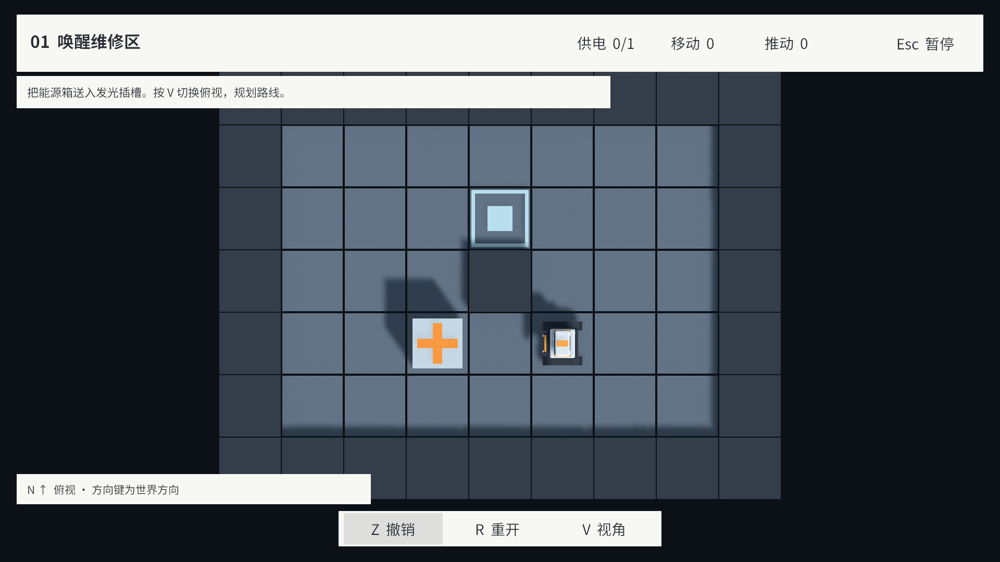

# 第三轮：简约 KToolkit UGUI 与幕布过渡

阶段：03-UI · 日期：2026-09-16。

本页保留该轮实现、验证与限制；当时的“当前”及待办以该轮为准。最新范围见 [当前实现状态](../../ImplementationProgress.md)，阶段顺序见 [文档索引](../../README.md)。

依据用户确认的第二版简约草图，将 LevelRunner 中的运行时 IMGUI 替换为 KToolkit KUIPage + UGUI。加入主菜单、HUD、纯文字选关、暂停、结算、设置和独立过渡页，七个 Prefab 保存在规定的 Resources/UI_prefabs/screens 路径。

- 启动先显示主菜单；设置支持音量、镜头灵敏度、垂直反转并持久化。既有关卡数据、机器人和规则保持原有接口。
- 参考 Element_Ballance 的 GeneralFadePage：主菜单与关卡水平开合，关卡之间垂直开合，每段 0.6 秒。完全遮盖后切换，展开完成后解锁；使用非缩放时间，支持暂停中返回主菜单。
- UGUI 控件绑定真实 GameSession 数据。重复导航和过渡期间指令被拒绝，持有的旧按键不会带入新关卡；销毁时取消过渡回调并清理所有本轮页面。
- 编辑器试玩保持直接进入测试关，并保留参考解法保存，不允许进入正式关卡目录。
- 已目视检查 1920×1080 主菜单/选关/HUD、1280×720 结算及 2000×1500 设置与垂直幕布。实机发现并修正了按钮重复叠色与滑条越界。

最终 **54/54 EditMode、24/24 PlayMode 通过**，其中 9 项为新增 UI 集成测试。Console 0 错误、0 警告。Windows 开发构建在 `Builds/AuthoringMilestone/StationRestart.exe` 更新，0 错误、0 警告，约 112.52 MB；独立程序以 Direct3D 11 启动 7 秒，KToolkit 正常初始化，无异常日志。独立程序检查仅覆盖启动，完整交互与关卡回放由 Editor 测试覆盖。

记录：[UIImplementationResults.json](Validation/UIImplementationResults.json)。实现、资源与字体来源详见 [UIImplementation.md](../../UI/UIImplementation.md)。关卡进度/最佳成绩持久化、编辑器独立人工验收和最终发行构建在本轮仍为待办，最新范围见 [当前状态](../../ImplementationProgress.md)。本轮没有改动 KToolkit、机器人源文件、引擎/包版本或原有商业插件导入。

