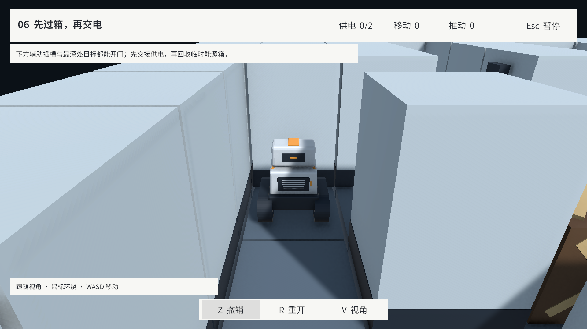

# 第四轮：普通箱与 L04–L06

阶段：04-CargoCrates · 日期：2026-09-16。

本页保留该轮实现、验证与限制；当时的“当前”及待办以该轮为准。最新范围见 [当前实现状态](../../ImplementationProgress.md)，阶段顺序见 [文档索引](../../README.md)。

按用户确认的追加方案实现两类箱子，并把全部三张草案依次接在原关卡之后：L01→L02→L03→L04「借一格」→L05「三箱锁喉」→L06「先过箱，再交电」。

- 普通箱可推动、滑行、占门防夹、撤销和重开；不会使目标或辅助插槽通电，也无需归位。能源数量校验、开局完成判断和 HUD 均按能源箱计算。
- 白模普通箱采用棕色箱体和顶部/四侧交叉支架，能源箱保留原十字标记。侧面支架控制在原推箱接触容差内，并实际检查机器人推板到可见箱面的误差不超过 0.01 m。
- 编辑器新增普通箱画笔、C/X 格标记、箱型属性及 L04–L06 示例入口。类型随保存、复制、Undo、草稿、配方和试玩快照保留。
- 新图采用 schemaVersion=2 与显式 kind。旧 v1 保留能源箱语义和原序列化哈希；旧图加入普通箱时升级版本。v2 缺失/非法字段、未知类型与 v1 夹带 kind 被拒绝。
- 三张新关通过 RecipeImporter→LevelDocument→Save 制作，参考解法由正式共享规则生成。L03 仅调整完成文案并重新验证解法，让末关结算移到 L06。

验证：**82/82 EditMode、27/27 PlayMode 通过**。覆盖普通箱不供电、Any/All、门占据、混合箱不可连推、低摩擦、撤销/重开、旧版哈希、配方往返、类型切换、六关目录、L03→L06 连续通关及滚动选关进入 L06。外观接触与最终出生朝向调整另做针对性复核，完整 job 与汇总见 [CargoCrateIterationResults.json](Validation/CargoCrateIterationResults.json)。

额外通过 UI Toolkit 导航/指针事件操作普通箱画笔、格子与箱型控件，验证类型切换→撤销→保存重读。通过“试玩并录制”按钮进入 L04，按世界方向回放至 22 步/8 推，再经真实 UGUI 射线命中“保存参考解法”，退出后作者初始布局哈希与箱型保持一致。工作区原草稿已按字节恢复；此记录不是独立用户易用性评审，也不扩大为 E01–E12 全部验收。

目视检查了 L05 俯视布局与两类箱子标记、L04/L06 开场跟随视角。首次检查发现出生朝向把跟随相机挤入机器人，已将 L04 朝向设为 W、L05/L06 设为 N，并重新绑定解法；未修改谜题占格或门连接。此检查不代表全部镜头角度的完整验收。

首轮 PlayMode 回归发现目录在编辑器撤销/重载后退回三项；清除本次目录操作的 Undo 记录、用不产生 Undo 的序列化写入重新保存并强制导入后，磁盘、重载及最终游戏流程均保持六关。一次最终单项测试在域重载后未启动，按项目 MCP 恢复流程清理孤立任务后重跑；失败/未启动尝试未计为通过。

本轮验证的是 Unity 工程与 Editor 运行流程，未重新生成 Windows 独立包，也未测量新关人工难度或通关时间。

