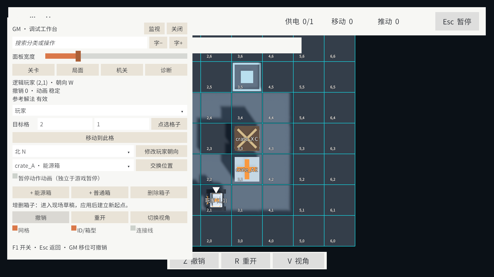
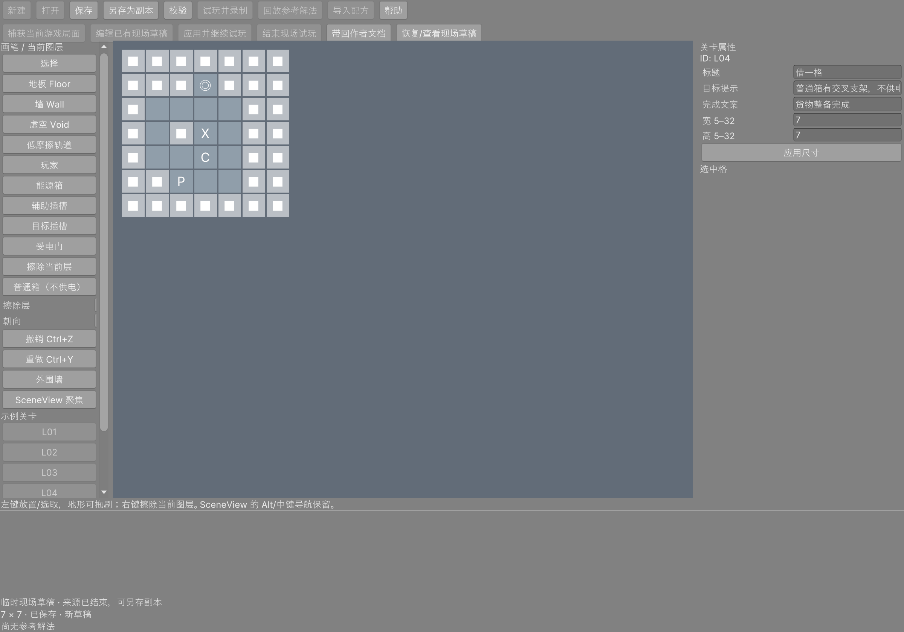

# 第五轮：可撤销 GM 与现场关卡编辑

阶段：05-GmLiveEditing · 日期：2026-09-16。

本页保留该轮实现、验证与限制；当时的“当前”及待办以该轮为准。最新范围见 [当前实现状态](../../ImplementationProgress.md)，阶段顺序见 [文档索引](../../README.md)。

日期：2026-09-16。完成 GM/现场编辑方案的 M1–M3 主要能力，普通箱与能源箱均适用。操作入口与保存边界见 [LevelEditorGuide.md](../../Editor/LevelEditorGuide.md)。

- Editor 与开发构建按 F1 打开 KToolkit UGUI 工作台，支持分类搜索、坐标/点选移位、朝向、交换位置、机关与输入状态、诊断快照复制，以及网格/ID/连接线显示。
- 普通移动与 GM 移位共用完整历史条目，撤销同时恢复状态、指令记录和录制资格。箱型绑定 ID；普通箱占插槽不供电，门仍使用占据保护。GM 修改不会增加或清零移动/推动计数。
- 现场模式复用现有 Level Editor，在 Play Mode 内捕获稳定局面、编辑独立草稿、应用并继续。新规则与隐藏棋盘准备好后才切换，失败保留旧局面。箱子数量/类型、地形、机关与尺寸修改建立新的试玩起点；编辑 Undo/Redo 和玩法 Z 的边界分开。
- 临时草稿与原作者文档、原文件分开保存。支持备份、另存新 ID 副本、带回原作者文档的版本检查，以及结束现场试玩后恢复原局面、历史、相机和暂停状态。GM 页结束操作也同步恢复打开的作者窗口。
- v1 的来源定义与哈希保持兼容；引入 Cargo 时升级 v2，编辑撤销可恢复版本。运行快照允许玩家站门格及能源不足警告，正式作者校验保持原要求。现场起点和未撤销的 GM 修改不能冒充原关卡参考解法。

验证汇总：[GMAndLiveEditingResults.json](Validation/GMAndLiveEditingResults.json)。

| 检查 | 本轮结果 |
|---|---|
| 完整项目 EditMode 回归 | 90/90 通过，覆盖既有规则、六关目录、作者工具与新增快照/现场工作区 |
| 完整项目 PlayMode 回归 | 31/31 通过，覆盖既有关卡/UI 与新增 GM 交互 |
| 收尾修复复测 | 材质引用修复后 GM 的 4 项 PlayMode 通过；GM 结束与作者窗口同步修复后窗口输入用例单独通过 |
| 窗口与游戏 UI | UGUI 射线 + PointerClick 验证移位/撤销；Input System 验证 F1/Esc；UI Toolkit 导航/指针完成捕获、画低摩擦、放普通箱、改型/撤销、应用与返回 |
| 重复应用 | 10 次箱型/地形修改、应用，棋盘和相机各保持一个，返回恢复原会话 |
| 实际脚本域重载 | 在现场编辑中请求重载，草稿 JSON 前后相同；旧会话失效后保持脱离草稿，不误应用 |
| 原工作保护 | Current.json 与 Playtest.json 在本轮前后 SHA-256 相同；未改写原关卡 JSON |
| Windows Development | 构建成功，0 错误/0 警告，约 112.69 MB；隐藏启动 8 秒，KToolkit 初始化，无异常/缺失脚本日志 |
| Windows 非 Development | 构建成功，0 错误/0 警告，约 86.13 MB；隐藏启动 8 秒，无异常/缺失脚本日志 |
| Player 隔离 | PE 元数据确认 GmPage/GmOverlay 只存在于开发版；两种 Sokoban.Runtime 均无 UnityEditor 程序集引用；GM Prefab 缺失脚本数为 0 |
| Console 与画面 | 最终 0 错误/0 警告；检查 1920×1080 GM、网格与两类箱子标记，以及现场草稿恢复界面 |

首次开发包虽然构建成功，但启动时暴露了 URP Unlit Shader 被剔除的异常。已改成 GM Prefab 显式引用材质并重新构建、启动验证；该失败启动不计为通过。界面检查还修复了滚动区域裁掉常用按钮、中文下拉框文字裁切，以及叠加标签在相机更新前投影导致的错位。

构建路径为 `Builds/GMIterationDevelopment/StationRestart.exe` 与 `Builds/GMIterationRelease/StationRestart.exe`，构建产物不进 Git。非开发版不加载 GM，但 Resources 中仍可包含其纯内置组件 Prefab 与材质；本轮验证的是入口/类型隔离，未新增资源剔除流水线。

独立程序检查限于启动与程序集隔离，完整交互由 Editor 内实际控件输入验证；原生保存文件对话框没有自动化点击，另存文件写入与保护逻辑已测试。本轮没有进行独立用户易用性评审、原生资源分配失败注入或全平台压力测试，也不把原 GDD 的 E01–E12 全部标为通过。M4 可视回放、Microstep 逐步检查与调试快照回放仍待后续。

