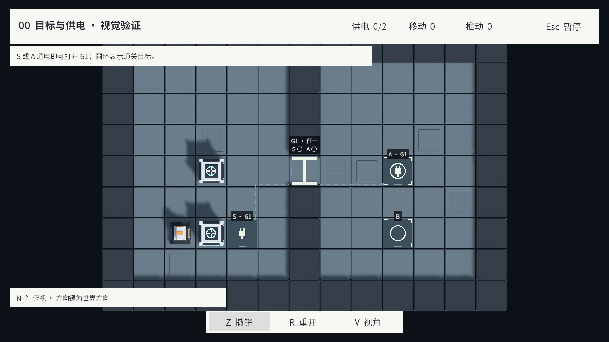
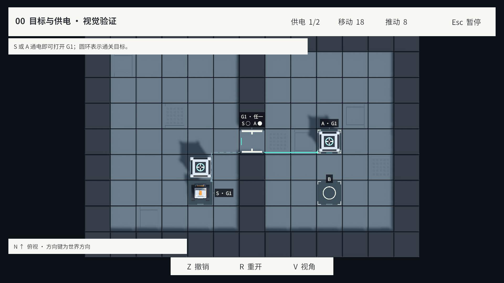
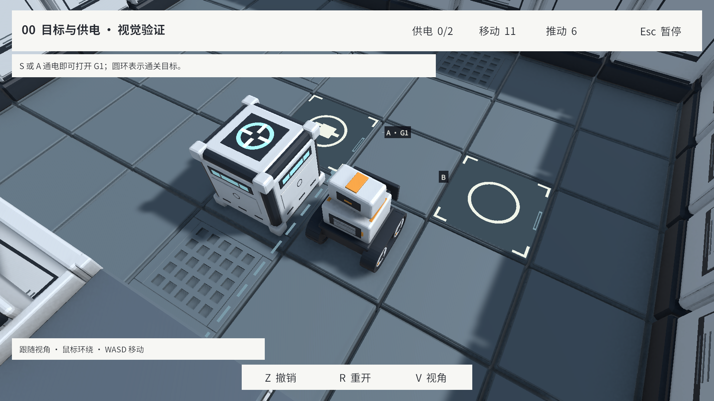
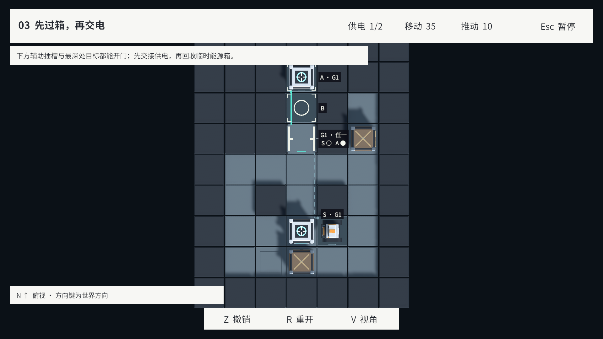

# v0.2.0 · 插槽与受电门可读性实现

日期：2026-09-17（America/New_York）。状态：已完成。依据 [修正后的方案与概念图](../../Art/VisualReadabilityReview.md)，版本范围见 [V0.2.0](../../Versions/V0.2.0.md)。

## 实现

- 圆环与外角标表示目标；插头专指被门引用的供电来源。A 同时显示环和插头，S 只有插头，B 只有目标环；无关目标不生成连接端口。
- 来源标签复用主题绑定，门短编号由稳定 ID 排序。每条分支独立消费对应插槽的真实电力，断电虚线、通电实线，门标牌的各来源空心/实心点分别更新。
- 门标牌显示“任一/全部”，门的条件灯和通行图形分别使用 PoweredGates 与 OpenGates；断电但被占据时标出“占据保开”。
- 功能格使用普通地板与简洁平面标记。保留原 Blender、FBX、Prefab GUID 和双段门动画；旧细碎标记仅在运行时实例中隐藏。
- 路由先绕开墙和无关插槽，狭窄通道允许沿无关目标边缘通过，不在目标中心画假连接点。没有地面通路时保留身份关联，不绘制穿墙路径。交叉线保留断口以避免误读为连接节点。
- 标牌在 Cinemachine 镜头更新之后投影到独立、无交互射线的 Canvas；按屏幕高度保证 14–20 px 字号，避开功能图案、箱子与 HUD，必要时用短引线指回地块。跟随视角检查墙体遮挡。
- 超过四路输入时常态显示数量、聚焦后展开来源；超过八条分支时按聚焦显示连线。大规模自定义网络仍需单独做密度与可读性验证。

代码入口：[BoardView](../../../Assets/Scripts/Presentation/BoardView.cs)、[布局与路由](../../../Assets/Scripts/Presentation/StationCircuitLayout.cs)、[状态与标牌](../../../Assets/Scripts/Presentation/StationCircuitView.cs)、[复用图形资源](../../../Assets/Scripts/Presentation/StationCircuitMesh.cs)、[机械门](../../../Assets/Scripts/Presentation/StationGateView.cs)。

## 验证

| 检查 | 结果与证据 |
| --- | --- |
| Unity 导入、编译、Console | Unity 2022.3.51f1；最终 Console 0 条错误 |
| 路由和稳定身份 EditMode | [3/3 通过](Validation/CircuitLayoutTests.json)；覆盖数据重排、一源多门、窄道避开墙与无关目标图形、断路不伪造连线；MCP job `42fabad04f884dd4aa9e3e73919ecb82` |
| 完整项目 PlayMode | [41/41 通过](Validation/PlayModeTests.json)，0 失败/跳过；包含当前三关完整参考解法与菜单/GM/现场重建，以及新增的身份组合、真实推动供电交接、占门保开、标签与资源释放；MCP job `a7c5f9625344469fa58996a2a2dc8944` |
| 实机视觉 | [九张原始截图与元数据](Validation/VisualChecks.json)：1920×1080、1280×720、全图/放大俯视、跟随视角、供电交接与引擎内灰阶；逐张查看 |
| 编辑器恢复 | Bootstrap 非运行状态、场景无待保存修改；Game View 恢复原索引 3（1920×1080），灰阶临时 Volume 已移除 |

首轮实机发现 L06 连续目标的标签压住主图形，已调整为根据屏幕障碍选择格边位置；初版截图不作为最终通过证据。第一次完整 PlayMode 运行的唯一报告失败是新增占门夹具把能源箱替换成普通箱后，能源箱数少于目标数，触发已有合法性校验；补足夹具能源箱后重新跑完整 41 项并通过。[原失败记录](Validation/InitialPlayModeFailure.json) 保留。

原生 Test Runner 报告的根汇总是 41/41；本机重复触发逐项回调，文件中有 82 条回调记录、去重后 41 个用例，均为 Passed，不把重复回调计成额外用例。采用原生汇总与 MCP 的最终 summary 交叉确认，未以运行中 progress.total 作为通过数。

当前正式关卡由并行 v0.2.1 调整为 L04–L06。本轮对比局面是 `StationCircuitTests.ComparisonFixture()` 构建的独立测试数据，不加入 CampaignCatalog，也不恢复已删除的旧关卡资源。

## 实机画面

下图均由当前 Unity Play Mode 直接截图。S/A/B 对比局面使用 [已导出的测试数据](Validation/ComparisonFixture.json)，供电交接快照通过真实规则接受的命令重放获得；带动画的推动、撤销/重开另由 PlayMode 用例验证。

另见 [720p 初始](Images/ComparisonInitialTopDown720.png)、[720p 交接](Images/ComparisonHandoff720.png)、[720p 灰阶](Images/ComparisonHandoffGray720.png)、[俯视放大](Images/ComparisonZoom1080.png) 和 [L06 初始](Images/L06InitialTopDown1080.png)。灰阶使用临时 URP ColorAdjustments（saturation −100）直接渲染；没有后期修改截图。

## 范围与限制

- 本轮在 Unity 表现层实现，不修改 Blender、FBX、玩法规则或关卡数据。新增生成图形不是使用概念图贴在游戏画面上。
- 正式关卡和上述测试局面已验收；大量自定义连接、长标签和极端拥挤地图仍需专项视觉/性能检查。
- 本轮没有新建独立 Player 构建；编译、游戏操作和截图均在 Unity Editor Play Mode 完成。
