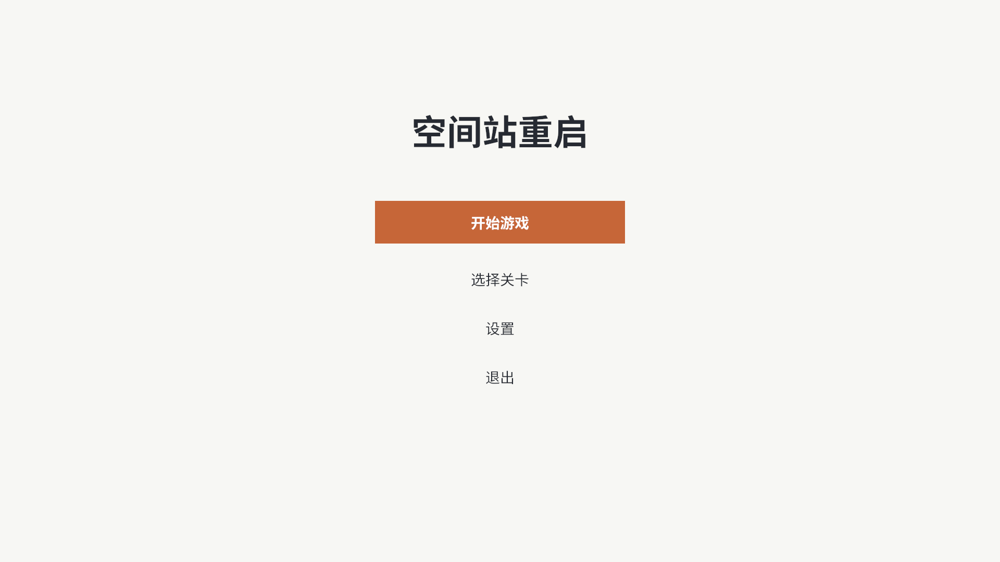
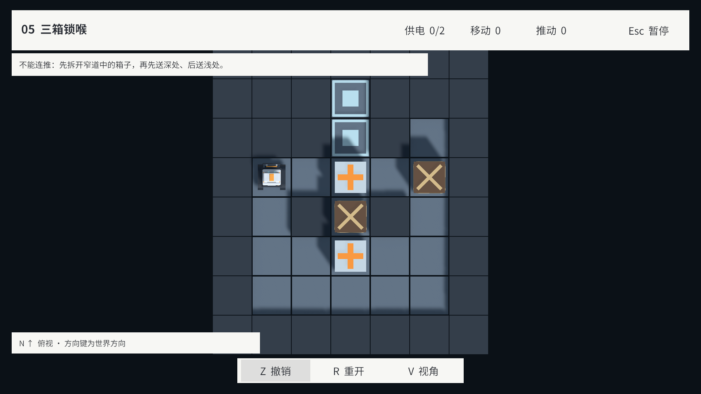

# 第一轮实现与验收记录

本文按迭代保存历史结果，后续章节补充较早状态。只在确认实现基线、处理相关回归或准备完整交付时读取；未完成产品范围不是每个任务自动追加的工作。验证记录保持原始覆盖范围，不因Agent指导重构而改写为通过。

日期：2026-09-16。范围：建立 GDD 第 1 天的作者数据→共享规则→真实机器人试玩闭环，同时提前实现供电、低摩擦、撤销、解法与编辑器工作保护。**本轮不是完整游戏或完整编辑器的最终交付。**

## 已实现

- 纯 C# Domain 程序集：整数占格、不可变运行状态、顺序 Microstep、Any/All 供电、门格占据保护、低摩擦滑行、撤销、重开与成功指令记录。
- 严格 JSON 读取：必需字段、数据类型、重复字段检查；语义校验与可定位的错误/警告；原子写入与内容哈希。Domain 不依赖 UnityEngine 或 JSON 库。
- UI Toolkit Level Editor 与 SceneView 网格：新建/打开/保存/副本、四种地形、分层实体、移动/旋转/删除、门连接、尺寸调整、撤销重做、草稿恢复、校验定位、配方导入、试玩录制与解法回放。
- Bootstrap、嵌套 Robot 的 PlayerActor、手动 Playables 采样、由 DOTween 统一驱动的可取消动作。现有 Robot/FBX/材质与源文件保持原状。
- Cinemachine 2.x 跟随/环绕和北向正交相机、相机相对与世界方向输入、开发 HUD、暂停/重开/完成提示。
- 从作者接口生成 L01、L02、L03、LAB01 JSON 与哈希绑定解法。

## 验证环境与范围

- MCP：CoplayDev 10.2.0，`http://127.0.0.1:8087/mcp`，实例 `Sokoban_3D_Test@f09ff3cbd197c2f4`，工程根 `C:/recent_project/Sokoban_3D_Test`。
- Unity 2022.3.51f1；URP 14.0.11、Cinemachine 2.10.7、Input System 1.18.0 保持原版本。
- DOTween Utility Panel 可打开；运行时报告核心版本 1.2.825。当前自有程序集只引用核心 DLL，不使用尚未生成 asmdef 的插件 Modules/Pro 组件；本轮未改写用户已有的插件导入或配置。
- 实测结果由 MCP Test Runner 的最终 `result.summary` 判定，不使用跨域重载时可能不准确的 progress.total。

| 检查 | 本轮结果 |
|---|---|
| EditMode 规则/数据/作者操作 | 51 项通过，0 失败；包括脏状态、草稿路径保护、空玩家/空解法在保存与撤销中保持为空 |
| PlayMode 真实表现 | 10 项通过，0 失败；推板接触误差 ≤0.01 m，Z/R 在 0.05/0.30/0.65 s 的取消、暂停、滑行切镜头、10 次关卡装载清理 |
| L01 参考解法 | 8 步 / 3 推，玩家 `(3,4)`，目标通电 |
| L02 参考解法 | 32 步 / 16 推，玩家 `(8,2)`，目标全部通电 |
| L03 参考解法 | 68 步 / 28 推，玩家 `(15,3)`，目标全部通电 |
| LAB01 | 1 步 / 1 推，玩家 `(2,3)`，箱子 `(6,3)` |
| 未保存草稿试玩往返 | 经编辑器按钮回调进入正式场景，完成→撤销→再次完成→保存录制→退出；原 SampleScene 恢复，工作副本哈希前后相同 |
| 返回时解法 | `E`，1 步/1 推，绑定未保存副本的哈希，可在编辑器回放 |
| 编译与 Console | 脚本编译通过，最终无项目错误 |
| Windows 开发构建 | `Builds/AuthoringMilestone/StationRestart.exe` 最终构建成功，0 错误、0 警告，约 104.47 MB |
| 独立程序启动 | RTX 5070 Laptop GPU、Direct3D 11 下隐藏启动 7 秒，日志无异常；未做独立程序通关验收 |

试玩往返用 MCP 驱动窗口按钮回调与游戏 API，不能算作第 11.4 节要求的独立评审者纯鼠标键盘验收。窗口功能尚未逐项人工验收，E01–E12 不标记为全部通过。PlayMode 的 10 次装载清理也不等同于 10 次跨编辑器 Play Mode 的完整往返。

自动测试检查文件位于 `Assets/Scripts/Tests/EditMode` 与 `PlayMode`。截图为真实 Game View：`Docs/Images/LowFrictionPlaytest.png`。规则回放结果不是难度、最优解或首次试玩时长的证明。

机器可读记录：[FirstIterationResults.json](Validation/FirstIterationResults.json)。一次 PlayMode 重试在脚本域重载后未启动；恢复原场景并重新运行后 10/10 通过。该失败尝试没有被当成通过。首次无图形启动的 Null GPU 不支持 URP Shader，随后改用 Direct3D 11 完成有效启动检查；不是测得 60 fps 的性能验收。

最终审查修复了 Unity 内联序列化对空引用的默认填充：关卡 JSON 保留 `playerSpawn:null`，作者撤销和草稿保存使用字符串快照，空解法不会被伪造成参考解法。修复期间 Editor 一次停止响应 MCP；保留磁盘草稿并重启同版本 Editor 后，51/51 与 10/10 测试及最终构建均重新通过。首次构建有两条 MCP 临时断连警告，最终构建没有警告。

开发构建仅供本轮启动验证，仍包含 Resources 内的实验数据，默认直接进入 L01。重复构建时将 Bootstrap 作为唯一场景，通过 MCP `manage_build(action="build", target="windows64", development="true", scenes="[\"Assets/Scenes/Bootstrap.unity\"]", output_path="Builds/AuthoringMilestone/StationRestart.exe")`。本地产物与日志不进 Git。

## 未完成的产品范围

1. **E10 正式关卡目录**：CampaignCatalog 资源与运行时读取已在第二轮接入；窗口加入/移出/排序、构建前全量回放门禁仍待完成。
2. **完整游戏流程**：第三轮已替换为 KToolkit UGUI，并加入主菜单、设置保存和幕布过渡；持久化关卡进度与最佳成绩仍待完成。详见 [UIImplementation.md](UIImplementation.md)。
3. **编辑器验收**：从空白图通过实际鼠标键盘或等价界面输入自动化跑通第11.4节，检查连续拖刷、键盘焦点、关闭/取消、文件占用与域重载，完成E01–E12记录。Agent可自主执行功能验收；独立用户易用性评审另行记录，不阻塞其他已授权工作。
4. **表现补全与相机验收**：角色气泡、音效/反馈、门动画、明确区分两类插槽与连接说明、俯视门上部遮挡处理、窄门/贴墙/转角和 L03 全图取景；投影切换时刻、暂停相机行为及多键长按仍需完整验收。
5. **最终交付**：采用正式目录的 Windows 构建、排除开发测试数据、实际独立完成至少两关、进度重启恢复、性能测量、其他策划独立操作与完整证据。本轮的开发构建不能替代这些验收。

工作区原有 `ArtSource/Robot/Robot.blend`、`ProjectSettings/ProjectSettings.asset` 以及未跟踪的 DOTween/插件资源不纳入本轮代码提交。新代码在当前工作区依赖该 DOTween 核心 DLL；在另一台机器还原工程时必须同时提供已授权的插件。没有刷新机器人源文件哈希，也没有把旧资产验收标成完整游戏接入验收。

## 第二轮：通关继续与选关

触发：第一关通关后仅有“重开本关”和“撤销最后一步”，无法进入下一关。首轮并未实现关卡串联。

- `CampaignCatalog.asset` 按顺序引用 L01、L02、L03；目录读取校验结构、空引用与重复 ID，LAB01 默认不进入列表。
- L01/L02 结算新增“下一关”和“返回选关”，并显示本局移动/推动统计。L03 显示“空间站已重启”，没有越界的下一关按钮。
- 暂停页可以打开选关。关闭选关保留原局面与之前的暂停状态；选择关卡会取消当前动作，建立新 Session 并清空输入缓存、计数和撤销历史。
- 逻辑已完成但动画尚未结束时禁止跳关。编辑器试玩保持独立，只提供录制与当前关卡操作。
- 当前三关均可直接选择，未引入持久化解锁/成绩或主菜单。E10 的完整作者界面与构建门禁仍不标记完成。

回归以真实 LevelRunner 播放参考解法。修复前用例报“L01 已完成，但没有进入下一关的操作入口”，MCP job `8ad6a34a14184e93bde7cbaded96ad5d`；最终结果见 `Docs/Validation/CampaignFlowResults.json`。

本轮结果：**54/54 EditMode、15/15 PlayMode 通过**。Windows 开发版原路径已更新，构建 0 错误、0 警告。通过实际鼠标点击“下一关”进入 L02，移动/推动/撤销计数均为 0；实际点击选关入口与返回按钮通过。暂停菜单由运行时 API 打开，本轮界面验证未覆盖 Esc 的键盘输入。

## 第三轮：简约 KToolkit UGUI 与幕布过渡

依据用户确认的第二版简约草图，将 LevelRunner 中的运行时 IMGUI 替换为 KToolkit KUIPage + UGUI。加入主菜单、HUD、纯文字选关、暂停、结算、设置和独立过渡页，七个 Prefab 保存在规定的 Resources/UI_prefabs/screens 路径。

- 启动先显示主菜单；设置支持音量、镜头灵敏度、垂直反转并持久化。既有关卡数据、机器人和规则保持原有接口。
- 参考 Element_Ballance 的 GeneralFadePage：主菜单与关卡水平开合，关卡之间垂直开合，每段 0.6 秒。完全遮盖后切换，展开完成后解锁；使用非缩放时间，支持暂停中返回主菜单。
- UGUI 控件绑定真实 GameSession 数据。重复导航和过渡期间指令被拒绝，持有的旧按键不会带入新关卡；销毁时取消过渡回调并清理所有本轮页面。
- 编辑器试玩保持直接进入测试关，并保留参考解法保存，不允许进入正式关卡目录。
- 已目视检查 1920×1080 主菜单/选关/HUD、1280×720 结算及 2000×1500 设置与垂直幕布。实机发现并修正了按钮重复叠色与滑条越界。

最终 **54/54 EditMode、24/24 PlayMode 通过**，其中 9 项为新增 UI 集成测试。Console 0 错误、0 警告。Windows 开发构建在原路径更新，0 错误、0 警告，约 112.52 MB；独立程序以 Direct3D 11 启动 7 秒，KToolkit 正常初始化，无异常日志。独立程序检查仅覆盖启动，完整交互与关卡回放由 Editor 测试覆盖。

记录：[UIImplementationResults.json](Validation/UIImplementationResults.json)。实现、资源与字体来源详见 [UIImplementation.md](UIImplementation.md)。关卡进度/最佳成绩持久化、编辑器独立人工验收和最终发行构建仍按前文待办处理。本轮没有改动 KToolkit、机器人源文件、引擎/包版本或原有商业插件导入。

## 第四轮：普通箱与 L04–L06

按用户确认的追加方案实现两类箱子，并把全部三张草案依次接在原关卡之后：L01→L02→L03→L04「借一格」→L05「三箱锁喉」→L06「先过箱，再交电」。

- 普通箱可推动、滑行、占门防夹、撤销和重开；不会使目标或辅助插槽通电，也无需归位。能源数量校验、开局完成判断和 HUD 均按能源箱计算。
- 白模普通箱采用棕色箱体和顶部/四侧交叉支架，能源箱保留原十字标记。侧面支架控制在原推箱接触容差内，并实际检查机器人推板到可见箱面的误差不超过 0.01 m。
- 编辑器新增普通箱画笔、C/X 格标记、箱型属性及 L04–L06 示例入口。类型随保存、复制、Undo、草稿、配方和试玩快照保留。
- 新图采用 schemaVersion=2 与显式 kind。旧 v1 保留能源箱语义和原序列化哈希；旧图加入普通箱时升级版本。v2 缺失/非法字段、未知类型与 v1 夹带 kind 被拒绝。
- 三张新关通过 RecipeImporter→LevelDocument→Save 制作，参考解法由正式共享规则生成。L03 仅调整完成文案并重新验证解法，让末关结算移到 L06。

验证：**82/82 EditMode、27/27 PlayMode 通过**。覆盖普通箱不供电、Any/All、门占据、混合箱不可连推、低摩擦、撤销/重开、旧版哈希、配方往返、类型切换、六关目录、L03→L06 连续通关及滚动选关进入 L06。外观接触与最终出生朝向调整另做针对性复核，完整 job 与汇总见 [CargoCrateIterationResults.json](Validation/CargoCrateIterationResults.json)。

额外通过 UI Toolkit 导航/指针事件操作普通箱画笔、格子与箱型控件，验证类型切换→撤销→保存重读。通过“试玩并录制”按钮进入 L04，按世界方向回放至 22 步/8 推，再经真实 UGUI 射线命中“保存参考解法”，退出后作者初始布局哈希与箱型保持一致。工作区原草稿已按字节恢复；此记录不是独立用户易用性评审，也不扩大为 E01–E12 全部验收。

目视检查了 L05 俯视布局与两类箱子标记、L04/L06 开场跟随视角。首次检查发现出生朝向把跟随相机挤入机器人，已将 L04 朝向设为 W、L05/L06 设为 N，并重新绑定解法；未修改谜题占格或门连接。此检查不代表全部镜头角度的完整验收。

首轮 PlayMode 回归发现目录在编辑器撤销/重载后退回三项；清除本次目录操作的 Undo 记录、用不产生 Undo 的序列化写入重新保存并强制导入后，磁盘、重载及最终游戏流程均保持六关。一次最终单项测试在域重载后未启动，按项目 MCP 恢复流程清理孤立任务后重跑；失败/未启动尝试未计为通过。

本轮验证的是 Unity 工程与 Editor 运行流程，未重新生成 Windows 独立包，也未测量新关人工难度或通关时间。

## 第五轮：可撤销 GM 与现场关卡编辑

日期：2026-09-16。完成 GM/现场编辑方案的 M1–M3 主要能力，普通箱与能源箱均适用。操作入口与保存边界见 [LevelEditorGuide.md](LevelEditorGuide.md)。

- Editor 与开发构建按 F1 打开 KToolkit UGUI 工作台，支持分类搜索、坐标/点选移位、朝向、交换位置、机关与输入状态、诊断快照复制，以及网格/ID/连接线显示。
- 普通移动与 GM 移位共用完整历史条目，撤销同时恢复状态、指令记录和录制资格。箱型绑定 ID；普通箱占插槽不供电，门仍使用占据保护。GM 修改不会增加或清零移动/推动计数。
- 现场模式复用现有 Level Editor，在 Play Mode 内捕获稳定局面、编辑独立草稿、应用并继续。新规则与隐藏棋盘准备好后才切换，失败保留旧局面。箱子数量/类型、地形、机关与尺寸修改建立新的试玩起点；编辑 Undo/Redo 和玩法 Z 的边界分开。
- 临时草稿与原作者文档、原文件分开保存。支持备份、另存新 ID 副本、带回原作者文档的版本检查，以及结束现场试玩后恢复原局面、历史、相机和暂停状态。GM 页结束操作也同步恢复打开的作者窗口。
- v1 的来源定义与哈希保持兼容；引入 Cargo 时升级 v2，编辑撤销可恢复版本。运行快照允许玩家站门格及能源不足警告，正式作者校验保持原要求。现场起点和未撤销的 GM 修改不能冒充原关卡参考解法。

验证汇总：[GMAndLiveEditingResults.json](Validation/GMAndLiveEditingResults.json)。

| 检查 | 本轮结果 |
|---|---|
| 完整项目 EditMode 回归 | 90/90 通过，覆盖既有规则、六关目录、作者工具与新增快照/现场工作区 |
| 完整项目 PlayMode 回归 | 31/31 通过，覆盖既有关卡/UI 与新增 GM 交互 |
| 收尾修复复测 | 材质引用修复后 GM 的 4 项 PlayMode 通过；GM 结束与作者窗口同步修复后窗口输入用例单独通过 |
| 窗口与游戏 UI | UGUI 射线 + PointerClick 验证移位/撤销；Input System 验证 F1/Esc；UI Toolkit 导航/指针完成捕获、画低摩擦、放普通箱、改型/撤销、应用与返回 |
| 重复应用 | 10 次箱型/地形修改、应用，棋盘和相机各保持一个，返回恢复原会话 |
| 实际脚本域重载 | 在现场编辑中请求重载，草稿 JSON 前后相同；旧会话失效后保持脱离草稿，不误应用 |
| 原工作保护 | Current.json 与 Playtest.json 在本轮前后 SHA-256 相同；未改写原关卡 JSON |
| Windows Development | 构建成功，0 错误/0 警告，约 112.69 MB；隐藏启动 8 秒，KToolkit 初始化，无异常/缺失脚本日志 |
| Windows 非 Development | 构建成功，0 错误/0 警告，约 86.13 MB；隐藏启动 8 秒，无异常/缺失脚本日志 |
| Player 隔离 | PE 元数据确认 GmPage/GmOverlay 只存在于开发版；两种 Sokoban.Runtime 均无 UnityEditor 程序集引用；GM Prefab 缺失脚本数为 0 |
| Console 与画面 | 最终 0 错误/0 警告；检查 1920×1080 GM、网格与两类箱子标记，以及现场草稿恢复界面 |

首次开发包虽然构建成功，但启动时暴露了 URP Unlit Shader 被剔除的异常。已改成 GM Prefab 显式引用材质并重新构建、启动验证；该失败启动不计为通过。界面检查还修复了滚动区域裁掉常用按钮、中文下拉框文字裁切，以及叠加标签在相机更新前投影导致的错位。

构建路径为 `Builds/GMIterationDevelopment/StationRestart.exe` 与 `Builds/GMIterationRelease/StationRestart.exe`，构建产物不进 Git。非开发版不加载 GM，但 Resources 中仍可包含其纯内置组件 Prefab 与材质；本轮验证的是入口/类型隔离，未新增资源剔除流水线。

独立程序检查限于启动与程序集隔离，完整交互由 Editor 内实际控件输入验证；原生保存文件对话框没有自动化点击，另存文件写入与保护逻辑已测试。本轮没有进行独立用户易用性评审、原生资源分配失败注入或全平台压力测试，也不把原 GDD 的 E01–E12 全部标为通过。M4 可视回放、Microstep 逐步检查与调试快照回放仍待后续。

