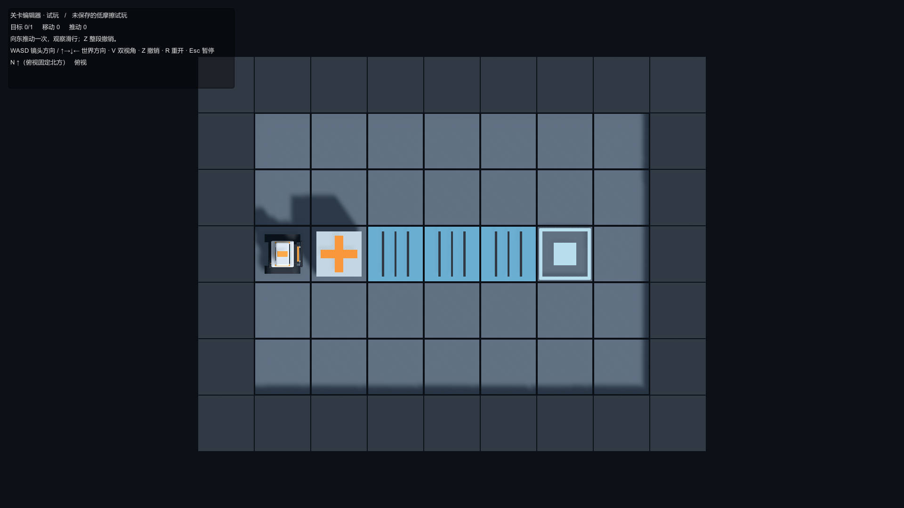

# 关卡编辑器使用说明

环境：Unity 2022.3.51f1、URP 14.0.11。入口：**Sokoban_Tools > Level Editor**。

这是可用的制作与试玩基础版本，不是 GDD 第 6 节 E01–E12 的完整验收版本。正式目录资源和游戏内选关已经接入，编辑器窗口中的目录管理仍待实现；第一次编辑建议直接打开左侧的 L01 或 LAB01。

可撤销 GM 与 Play Mode 现场编辑的行为约定见 [GM 与关卡编辑器现场试玩迭代方案](GMAndLiveEditingPlan.md)。当前操作方式见下文，验证范围见 [实现记录](ImplementationProgress.md)。

## 从空白关卡开始

1. 点击“新建”。默认地图 9×9；在右侧设置宽高（5–32）并点击“应用尺寸”。点击“外围墙”可封闭边界。
2. 填写标题、目标提示、完成文案。文字在结束编辑/按 Enter 后提交为一次撤销操作。
3. 选择左侧画笔，在窗口内的二维棋盘或 SceneView 网格上左键绘制。地图左下角为 `(0,0)`，上方为北 `+Z`；P 是玩家，C 是能源箱，X 是普通箱，◎ 是目标插槽，s 是辅助插槽，D 是门。
4. 放一个玩家、至少一个目标插槽、足够数量的能源箱。普通箱可以推动，但不供电、无需归位，不计入能源箱数量。选中箱子后可在右侧“箱子类型”中修改，修改支持撤销。可以先做玩家 `(1,3)`、能源箱 `(2,3)`、目标 `(6,3)` 的 9×7 小图。
5. 将 `(3,3)`、`(4,3)`、`(5,3)` 涂成低摩擦轨道。插槽和门只能放在普通地板上。
6. 在 `(7,3)` 放门。选择该门，在右侧设置朝向、Any/All，并勾选 `(6,3)` 的目标插槽。SceneView 中可以看到插槽到门的连线。
7. 点击“校验”。错误阻止试玩；警告允许试玩。点击带坐标的错误定位问题格。“结构合法”不代表关卡一定有解。

## 编辑与工作保护

- 左键选择/放置；地形支持连续拖刷。右键擦除当前“擦除层”：Terrain 为恢复地板，Devices 删除插槽/门，Actors 删除玩家/箱子。需要虚空时使用 Void 画笔。
- 涂 Wall/Void 会删除该格的实体和相关供电引用；一组拖刷可一次撤销。删除插槽会同步移除门引用，若来源为空，校验会报错。
- 选择格子后，可在右侧选择该格的不同层实体，输入 X/Z 后点击“移动到坐标”，或修改朝向、目标属性与门来源。Q/E 旋转所选玩家/门或后续放置朝向。
- Ctrl+Z/Ctrl+Y 撤销重做；Ctrl+S 保存。SceneView 的 Alt 与中键保留原生导航。
- 缩图前显示越界元素数并确认；扩图新增区域为 Void。尺寸修改可撤销。
- 未保存状态与当前路径显示在窗口底部。未保存草稿备份在 `Library/SokobanDrafts/Current.json`，重开窗口/脚本重载后恢复；撤销栈仅保证当前编辑会话。
- 保存采用同目录临时文件再替换目标。短暂文件占用会重试；最终失败在窗口提示，原目标不会先被删除。打开其他文件或关闭窗口时有保存/放弃/取消处理。
- “另存为副本”生成新的关卡 ID；副本选择不同文件名。解法跟随复制，但须重新回放才能建立新版本证明。

## 试玩、录制与返回

1. 点击“试玩并录制”。未保存内容可以直接试玩；工具保存独立快照，再通过 `playModeStartScene` 进入 Bootstrap。Unity 会按原生流程处理其他场景的未保存内容。
2. 游戏默认第三人称。方向键↑→↓←分别为 N/E/S/W；WASD 根据镜头方向映射；V 切俯视；鼠标环绕，滚轮缩放；Z 撤销；R 重开；Esc 暂停。
3. 上面的低摩擦小图只需按一次右方向键。玩家进入 `(2,3)`，箱子滑到 `(6,3)`，计数为 1 步/1 推。动作中 Z/R 也可取消整次表现。
4. 通关后点击“保存为参考解法”。随后退出 Unity Play Mode，原场景与原始作者摆放恢复；参考解法进入工作副本，需点击“保存”写入文件。
5. “回放参考解法”使用共享规则校验每条指令、终点与计数。修改关卡会使内容哈希过期；成功回放后更新哈希，再保存。参考解法回放当前是即时逻辑回放，不是可逐帧观看的演示动画。

编辑器试玩不保存正式玩家进度，也不显示“下一关”或运行时选关，以便保持作者副本与正式流程隔离。直接打开 Bootstrap Play 时，游戏读取 CampaignCatalog，支持通关后下一关、返回选关与暂停选关。目录资源在 `Assets/Resources/configs/CampaignCatalog.asset`，当前顺序为 L01→L02→L03→L04→L05→L06。

## 运行时 GM

Editor Play Mode 或开发构建中按 **F1** 打开 GM。工作台的关卡、局面、机关、诊断页支持搜索；顶部可调整字号、面板宽度和拖动位置。“监视”收起工作台并保留状态条，F1 可重新打开。

- 局面页选择玩家、能源箱或普通箱，输入 X/Z，或点击“点选格子”后选择面板外的棋盘格，再点击“移动到此格”。移动可跨墙和门，但目标格必须合法且不与其他对象重叠。
- 可修改玩家朝向、交换两个对象的位置。箱型绑定 ID，交换位置不交换箱型；普通箱放在插槽上不供电，放在断电门上会因占据保护保持门开。
- 底部“撤销”与游戏 Z 共用历史，可逐步撤销普通移动与 GM 移位。GM 不增加或清零计数；失败或无变化不产生历史。工作台打开时使用按钮撤销，键盘输入由 GM 占用。
- “暂停动作动画”独立于正式暂停菜单；关闭工作台后仍保持该开关状态，暂停期间不会接受新的移动。可在 GM 中取消它。
- 网格、ID/箱型、供电连接开关只改变显示。机关页分别显示占据者、通电与门打开原因；诊断页可复制包含定义、带类型的局面和最近操作的 JSON。
- GM 修改后不能保存原关卡参考解法。撤销回修改之前可恢复录制资格；现场起点始终属于调试试玩。
- Esc 优先取消点选，再关闭 GM；关闭后须释放原方向键才会继续移动。GM 不会自动打开正式暂停菜单。

GM 布局资产为 `Assets/Resources/UI_prefabs/screens/GM/Gm.prefab`；`Sokoban_Tools > Build GM UGUI Prefab` 只重建这个 Prefab，会覆盖其手工布局修改。

## 现场编辑并继续试玩

此功能在 Unity Editor 中使用。原作者文档、原关卡文件与临时现场草稿彼此独立。

1. 进入关卡，在 GM 的关卡页点击“现场编辑当前局面”，或在 Level Editor 点击“捕获当前游戏局面”。正在播放的动作对齐已提交的逻辑终点，再进入编辑。
2. 窗口显示“临时现场草稿”，游戏输入被占用。使用原有画笔、坐标属性、箱型控件、机关连接和尺寸工具编辑。Ctrl+Z/Ctrl+Y 只操作草稿。
3. 点击“应用并继续试玩”。错误会显示并保留旧棋盘；通过后创建新的规则与棋盘，从当前摆放重新计数，清空玩法撤销历史。回到 Game View 即可继续，不需退出 Play Mode。
4. R 恢复最近应用的现场起点；Z 只撤销这个起点之后的普通移动和 GM 移位，不跨越结构应用边界。修改箱型也属于结构应用。
5. 再次编辑可以选择“编辑已有现场草稿”，或重新捕获游戏中的最新位置。有未应用修改时，重新捕获会提供继续编辑、取消、替换的选择；旧草稿备份保留。
6. 点击“结束现场试玩”恢复首次捕获前的运行局面、撤销历史、相机、暂停状态与会话身份，并切回原作者文档。

GM 的“+能源箱”“+普通箱”“删除箱子”是现场草稿的快捷入口；检查修改后点击应用。普通箱不足以补充能源数量。现场模式可测试能源不足的局面，也允许玩家站在门格；转为作者关卡时仍执行正式出生点与能源数量校验。

保存操作有三种不同作用：

- **保存 / Ctrl+S**：备份临时现场草稿，不覆盖原 JSON。备份位于 `Library/SokobanDrafts/Live/`，最新工作区索引为 `Workspace.json`。
- **另存为副本**：通过正式校验后输出新 ID 的关卡文件，不自动生成参考解法或加入正式目录。
- **带回作者文档**：通过正式校验与原文档版本检查后，作为一次可撤销作者编辑带回，仍需在作者模式保存。原文档已变化或不是同一关卡时拒绝覆盖，可以另存副本。

关闭窗口会解除编辑输入占用并备份草稿。停止 Play Mode 后可通过“恢复/查看现场草稿”继续处理数据；脚本域重载后若原运行会话无法重连，草稿保持脱离状态，不自动应用到其他关卡。此时退出并重新进入 Play Mode，再捕获新的活动局面。跨域重载不保证保留编辑撤销栈。

旧 v1 关卡仅捕获不会自动升级；增加普通箱或把能源箱改为普通箱时升级到 v2，该编辑可整体撤销。箱型修改使原参考解法过期。现场快照回放和动画逐步检查属于后续 M4，本轮只提供诊断快照导出。

## 数据和示例

- 正式 JSON：`Assets/Resources/configs/levels/L01.json` 至 `L06.json`；L04–L06 为普通箱关卡，均可从左侧示例按钮打开。
- 新图使用 schemaVersion=2，箱型随保存/打开、副本和草稿恢复保留。旧版关卡按能源箱读取，加入普通箱时自动升级；改箱型会使原参考解法过期，需要重新回放。
- 实验关：`Assets/Resources/configs/test_levels/LAB01_LowFriction.json`。
- 解法：`Assets/Resources/configs/solutions/*.solution.json`。
- 可重新导入的作者配方：`Docs/LevelRecipes/*.json`。窗口“导入配方”与 `Tools > Sokoban > Import Design Recipes` 使用相同作者操作；批量入口不会覆盖已有文件。
- 运行时只读统一关卡 JSON；不读取配方或 Markdown。
- PlayerActor 包装现有 Robot，动画仍来自现有 FBX。不要为了重建关卡执行会重导出资产的机器人流水线。

编辑器内目录管理、进度存档、反馈和完整界面验收见 [后续范围](ImplementationProgress.md)；游戏菜单与选关UI的当前实现见 [UIImplementation.md](UIImplementation.md)。
