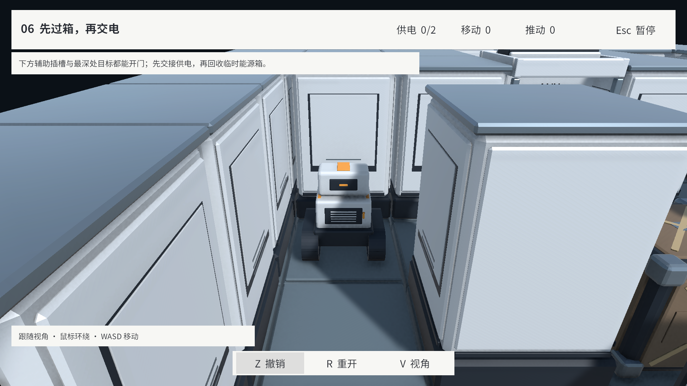

# 空间站套件游戏接入

2026-09-16（America/New_York）。首批 11 个资产已替换到实际游戏的 `BoardView`。
正式关卡 L01–L06、编辑器试玩和 GM/现场编辑重建都使用同一表现实现。
关卡 JSON、参考解法及 Domain 规则未修改。

## 入口与外观

- 打开 `Assets/Scenes/Bootstrap.unity`，进入 Play Mode，按原主菜单流程开始或选关。
- [运行时主题配置](../Assets/Resources/configs/StationKitTheme.asset) 显式引用 11 个 Prefab、材质、字形 Mesh 和已有字体，保证 Player 构建保留依赖。
- 三种地板采用稳定、稀疏的格坐标分布；墙体按邻接关系选择直段、转角、端头并旋转。T/十字仍是完整实心墙格。
- 两类箱子由 `CrateDefinition.kind` 选择，不以颜色、灯光或所在格推断类型。推动接口和动作时序不变。
- 低摩擦格复用新地板，加固定蓝灰涂装和原有条纹标记；格栅地板仍是普通 Floor。

## 来源身份与状态

`StationKitTheme.bindings` 按 `(levelId, socketId)` 保存外观键和短标签。正式来源 A/B/C/S/T 分别使用蓝、紫、黄绿、青绿、金色，搭配方形/三角/圆形和字母；同一来源在多个门上保持同样身份。
未配置的作者地图使用稳定的 ID 哈希选择样式，枚举顺序、移动、撤销和重开不改变绑定。
在 Inspector 中编辑主题即可调整配置，不需要改关卡格式或按颜色复制 FBX。

三路信号分别处理：

| 信号 | 驱动 |
| --- | --- |
| `PowerState.Sockets` | 插槽灯、各门对应来源标牌的灯 |
| `PowerState.PoweredGates` | 门的电源条件灯 |
| `PowerState.OpenGates` | 门板姿态、通行地标、相机遮挡代理 |

因此普通箱占槽不亮灯；普通箱占门、机器人接替占门时可以门开而灯灭。
Any/All 来自现有 `GateDefinition.powerMode`，地面和门框正面均有模式文字。
1–4 路输入在门前后各显示一次，关闭门板不会遮住全部来源。更多输入沿四边排列；超过 16 路用扩展文本列出余下来源。
正式关卡最多两路，自动化用例覆盖三路。超大自定义网络的显示密度未做专项易用性评估。

连接区域使用共享、有限的主题材质；状态切换只交换已缓存的材质槽数组，不修改共享底色，也不逐帧创建材质。
能源窗保持固定外观，普通箱无供电/连接槽。修正了 URP `EmissiveIsBlack` 标记导致发光关键字在重载时被清除的问题。
世界文字使用显式引用的 URP/Unlit 裁切材质并参与深度测试，不透过墙体显示；每个棋盘只有两份文字材质，动态字体图集重建时同步纹理，销毁时解除订阅。

## 动画、相机与恢复

- 门采用已交付的双段上收姿态，默认 0.18 秒，可通过主题调整；不缩小门板或移动资产根。
- 暂停、导航遮盖、GM 动画暂停统一冻结门动画。撤销、重开、重建、卸载取消旧 Tween，并直接恢复目标姿态与全部状态灯。
- 普通动作结束后允许门的短动画完成；新指令开始时使上一过渡收敛到已确认状态，避免下一次通行穿过尚未收起的门板。
- 俯视隐藏墙上部、门柱上部、收纳区、门板和门框文字；保留整格基座、来源标牌及通行地标。
- 墙和关闭门的 BoxCollider 仅用于现有 Cinemachine 避障。隐藏 Renderer 不改变碰撞代理或逻辑占格；箱子/插槽不添加物理驱动。

## 维护与验证

首次接入的生成入口为 `Tools > Station Kit > Prepare Gameplay Integration`。
已有主题的 Prefab、调色板和来源绑定不会被重建覆盖；该入口会补缺失的文字材质引用并校正主题发光标志。
Blender/FBX 的重新制作与资产验收仍沿用 [原生产说明](../ArtSource/StationKit/README.md)。

| 验证 | 结果 |
| --- | --- |
| 完整项目 PlayMode | [37/37 通过](Validation/StationKitGameplayTests.json)，包括六关原参考解法、菜单、GM、现场编辑、滑行、取消与暂停 |
| 文字深度修复后定向复测 | [8/8 通过](Validation/StationKitLabelRetest.json)，覆盖新套件、两类箱子、门状态、俯视、重建清理和 Esc 输入 |
| 实际关卡画面 | L05 北向俯视、L06 跟随视角、L03 多路连接及真实推动后的开门状态 |
| 构建与 Console | 见 [本轮汇总](Validation/StationKitIntegration.json) |

首轮测试包含旧白模节点名断言失败，现已改为检查交付资产的稳定节点。
同轮 Esc 输入用例出现一次失败，随后单项和完整回归均通过；未为此修改 UI 输入逻辑。
结果文件记录实际运行范围，不将资产演示夹具当作正式关卡回归。

