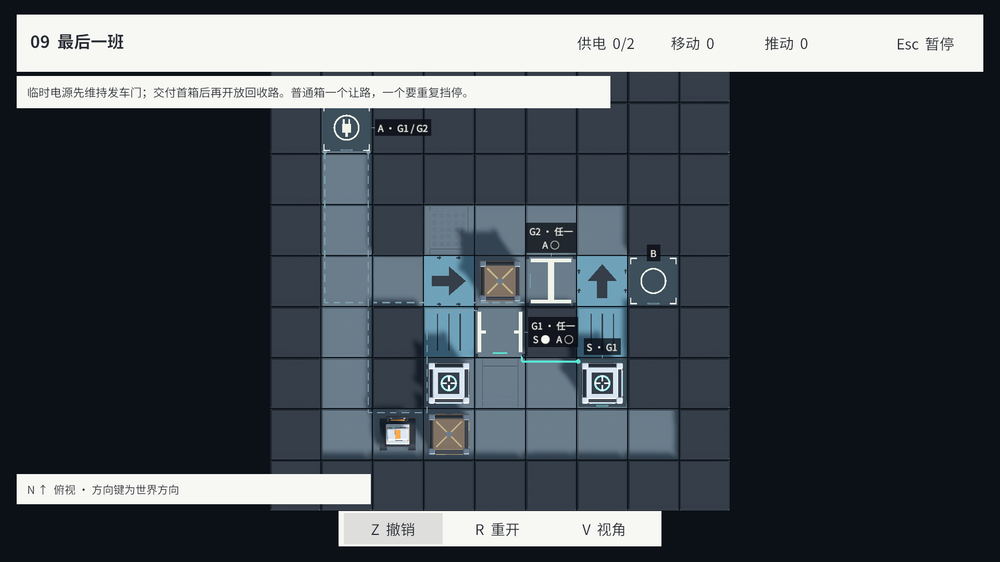
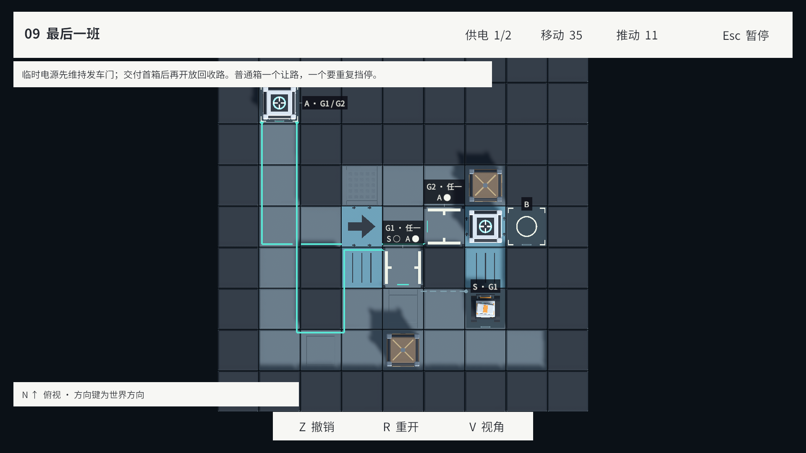
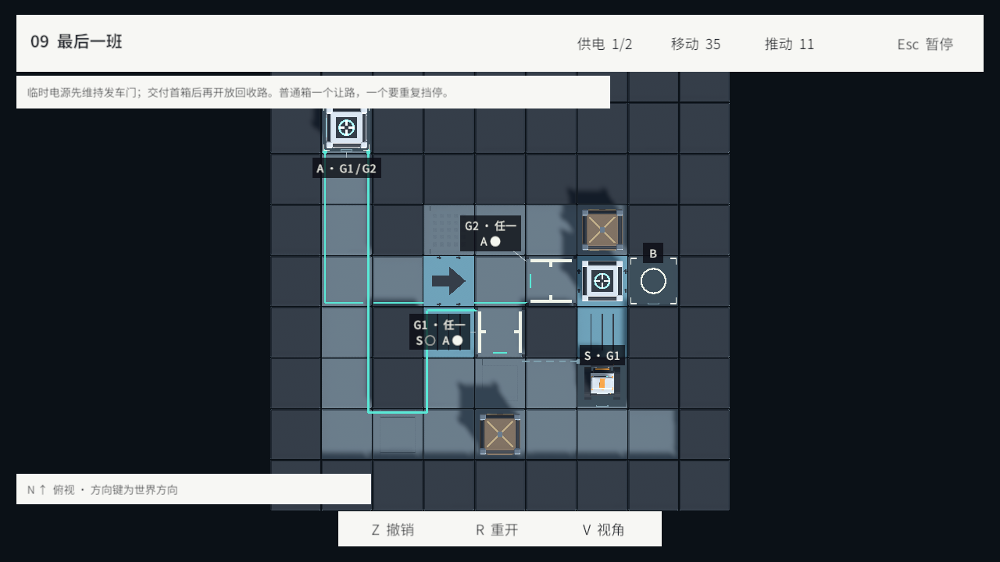
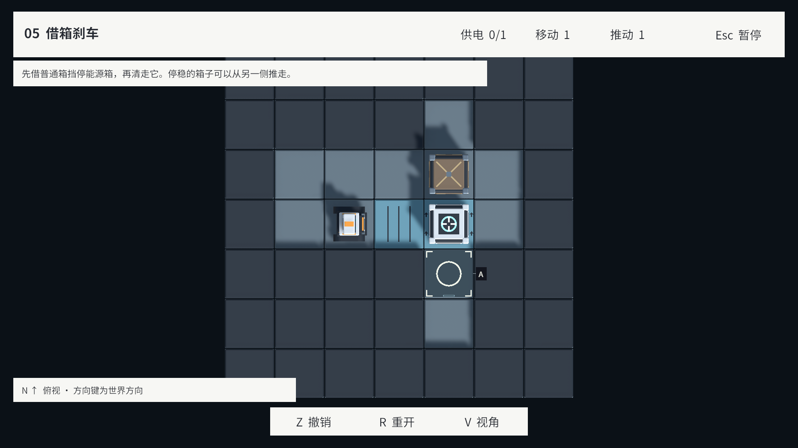
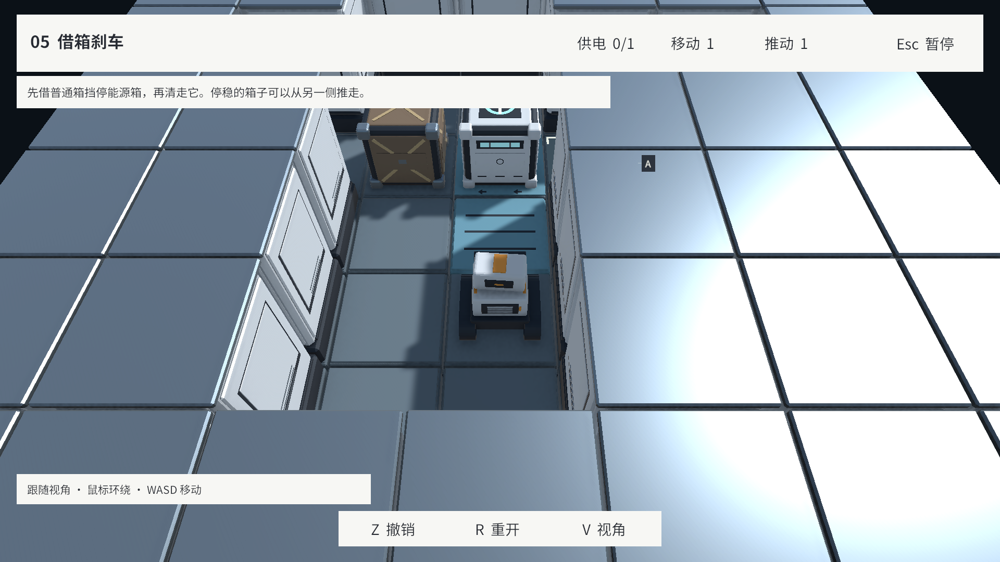

# v0.3.0 封版验收

日期：2026-09-17。Unity 2022.3.51f1 / Windows x64。范围为固定转向板、制作链和 L07–L12 六关；正式目录为 L04–L12，共九关。完整范围及限制见 [版本记录](../V0.3.0.md)。

| 检查 | 实际结果 | 证据 |
| --- | --- | --- |
| 全组 EditMode | 122/122 通过，包含真实窗口放板、转向、撤销/重做与现场恢复 | [MCP 结果](EditMode.json) |
| 最终规则与配方 | 31/31 通过，涵盖最终 L09 布局、旧格式哈希与六关作者/正式数据一致性 | [最终复测](FinalRulesAndRecipes.json) |
| 全组 PlayMode | 46/46 通过，九关完整动画通关与末关 UI 选关 | [MCP 结果](PlayMode.json)、[Unity 原始 NUnit XML](PlayMode.xml) |
| 最终表现专项 | 10/10 通过，含新增转向板标签避让、转弯路径、暂停/取消、相机与资源释放 | [最终表现结果](FinalPresentationTests.json) |
| 关卡机关用途 | 固定普通箱、封闭每扇门、断开临时电源的变体均搜索耗尽无解；离线检查不代替正式内核 | [分析结果](LevelMechanicChecks.json) |
| 实机画面 | 五张最终画面逐张检查，720p 交接局面标签/转向板重叠为 0 | [参数与图片哈希](VisualChecks.json) |
| Windows 构建 | 非开发版；约81.63 MB；0错误、0警告 | [构建报告](Build.json) |
| 独立程序启动 | 进程存活且响应，框架初始化，8秒启动日志无错误/异常 | [启动摘要](PlayerStartup.json)、[原始日志](PlayerStartup.txt) |
| 发布数据 | 九关尺寸、格式、参考计数、内容证明哈希、文件 SHA256；原有无关差异保留 | [封版清单](ReleaseManifest.json) |

构建位于 `Builds/V0.3.0/StationRestart.exe`，为本地交付产物，不进入 Git。开发版本封版不修改 PlayerSettings 产品版本、不创建标签、不发布。玩家实际难度与独立 Player 的逐关人工交互未由启动检查证明；九关交互与动画验收发生在 Editor PlayMode。

第一次 PlayMode 初始化没有启动成功；恢复并增加初始化窗口后完成全组。首次全组中一个新增用例在暂停菜单内发切镜头指令，违反既有输入约定；修正测试顺序后完整46项通过。随后实机发现门标签遮挡转向板，修复避让并新增验证，最终相关10项通过。完整运行测试与最后的表现专项分别保留，不将不同运行相加冒充一次测试。

## 最终画面

L12 最大9×9初始布局：

L12 首个目标接替电源，第二只箱子被挡停在转向板上：

L08 一次真实推动后，箱子压住转向板时边缘方向标记仍可见：

L12 截图使用正式 Session 回放参考路线的第35条指令并恢复表现，记录的是准确稳定局面；完整动画另由 PlayMode 测试覆盖。L08 截图经真实 TryMove 和 Presenter 推动。图片由 Unity ScreenCapture 原始输出，未经修改；初版遮挡截图未列为通过证据。
