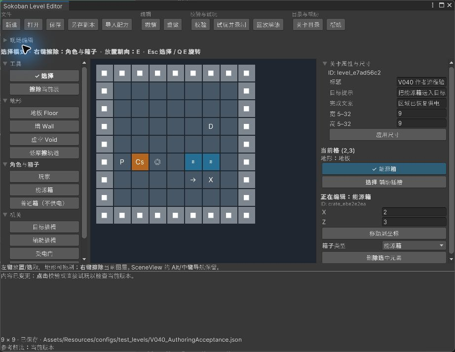
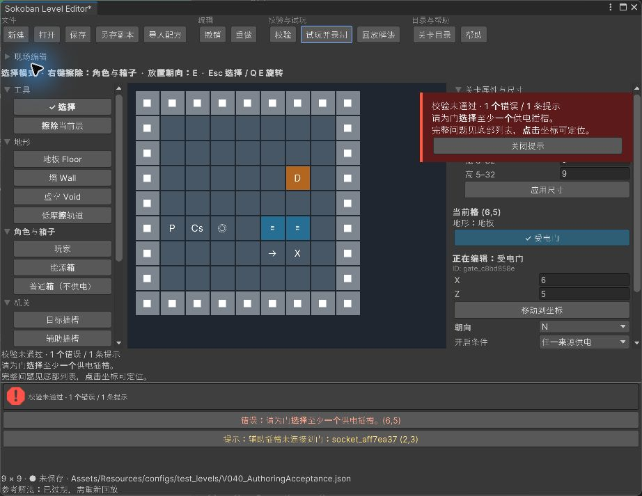
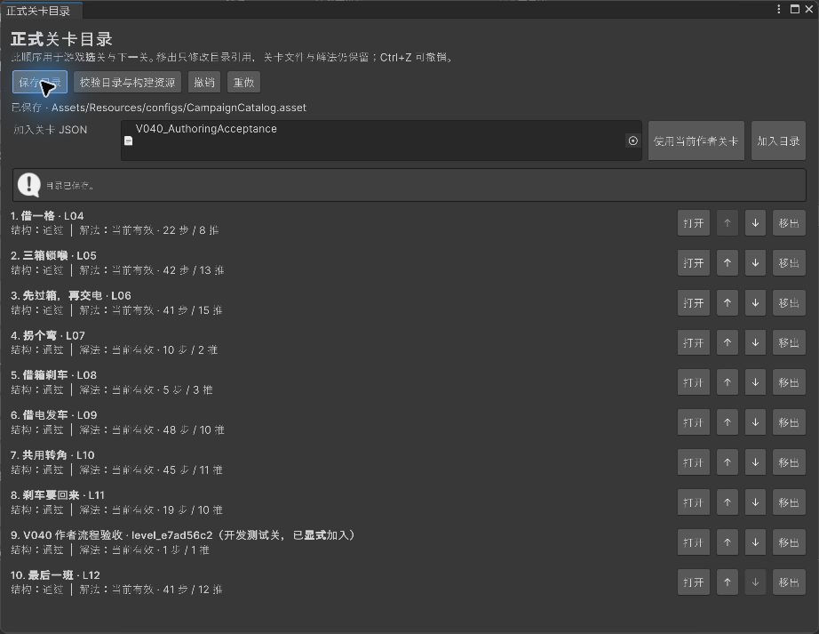
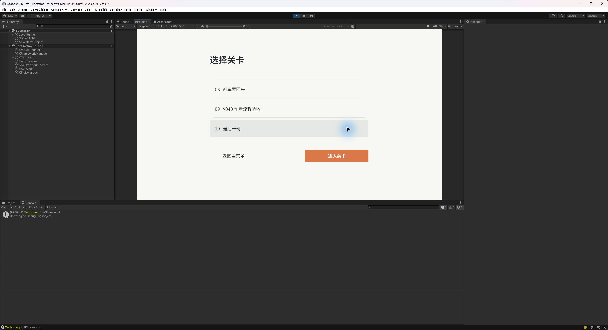

# v0.4.0 验收记录

日期：2026-09-17 · 实施基线：`cb88099` · 状态：通过本版本约定检查。范围与后续限制见 [版本计划](../V0.4.0.md)。

## 自动检查与构建

| 检查 | 最终结果 | 证据 |
| --- | --- | --- |
| 项目 EditMode | 140/140 | 本地 `Logs/V0.4.0/EditMode-140.xml` |
| 项目 PlayMode | 47/47 | 本地 `Logs/V0.4.0/PlayMode-47.xml` |
| 后续 UI / 试玩清理专项 | 12/12 | 本地 `Logs/V0.4.0/UiPlayMode-12.xml` |
| 真实坏目录构建 | 自动回调拒绝缺失 JSON 引用，预期构建失败 | [结果](NegativeBuild.json) |
| 真实合法目录构建 | Windows 非开发版成功，0 错误、0 警告，约 16.34 秒 | [结果](PositiveBuild.json) |
| 独立 Player 启动 | 进程启动、游戏框架初始化，无启动错误 | [结果](PlayerStartup.json) |

汇总、测试时间与保护对象哈希见 [Verification.json](Verification.json)。XML 和构建/运行原始日志位于被 Git 忽略的 `Logs/V0.4.0/`，构建产物位于 `Builds/v0.4.0/Windows/Sokoban.exe`。

缺失/畸形 JSON、重复 ID、结构错误及错误坐标、缺失/过期/非法命令/计数不符解法分别由目录测试覆盖；实际坏构建验证自动回调接入，没有针对每一种错误重复执行整次 Player 构建。

## 实际作者路径

1. 通过新版窗口“新建”建立 9×9 小图、外围墙、标题，放置玩家、能源箱、普通箱、目标/辅助插槽、门、固定转向板和低摩擦轨道。
2. 能源箱与辅助插槽同格；右侧可读名称和选中态可辨认。选择另一箱格与空格，核对格高亮、属性目标和底层选择状态；同格保留对象及鼠标捕获释放另有控件事件回归。
3. 门未连接时直接点击试玩，出现红色侧边提示和完整问题列表，未进入 Play Mode。修复来源后直接试玩通过；提示约 6 秒消失而列表保留由定时控件测试验证。
4. 真实鼠标拖刷两格轨道，撤销后整笔消失、重做后两格恢复。保存对话框写入独立临时 JSON，重开后地形和内容哈希一致。
5. 进入正式 LevelRunner 的作者试玩，录制 `E`，1 步/1 推完成。在结算界面保存参考解法，退出 Play Mode 回到原作者摆放，再保存、重开并校验当前证明。
6. 目录窗口“使用当前作者关卡→加入目录→上移→保存”，游戏选关页显示临时关卡位于第 9 项。随后“移出→保存”，关卡和解法文件仍在，目录恢复原九关。
7. 验收使用独立草稿和临时资源；收尾恢复用户作者文档和目录，并删除本轮临时 Assets 资源。可审阅的 [关卡定义](AuthoringLevel.json) 与 [参考解法](ReferenceSolution.json) 只保留在 Docs，不加入正式目录。

验证方式：真实鼠标覆盖主要编辑和目录操作、原生保存对话框；UI Toolkit 事件覆盖定位、属性切换和补充保存等路径。自动键盘短按没有跨过游戏的 `isPressed` 采样窗口，试玩移动以 Input System 的 RightArrow 状态事件保持 0.2 秒后释放完成，没有直接更改通关状态或伪造解法。

## 易用性步骤比较

| 操作 | 原实现 | 本版 |
| --- | --- | --- |
| 错误关卡直接试玩后查看原因 | 试玩看到笼统提示，再点校验，至少两个按钮动作 | 一次试玩点击直接显示完整问题和明显提示 |
| 找到箱子、插槽画笔 | 在枚举顺序的平铺列表中查找 | 按角色与箱子、机关分组，常用画笔仍直接点击 |
| 叠放对象切换 | 内部 ID、按钮没有选中标记，箱子遮住插槽字符 | 可读类型、✓ 当前对象，二维同时显示箱子/机关 |
| 从 A 切换到 B/空格 | 画笔模式与旧对象残留、笔划结束及刷新时序可能造成混淆 | 同步更新格与对象，空格清除旧属性，模式持续显示 |
| 管理正式目录 | 需要 Inspector 或外部脚本 | 专用窗口加入、排序、移出、保存并显示校验状态 |

比较依据是修改前的代码/作者指南和本次操作，不是独立用户实验或量化耗时研究。

## 验收发现与修正

- 选择操作原来参与画笔撤销；现在走独立选择路径。棋盘格复用，新的鼠标按下会结束遗留笔划，对象按钮重建属性列表前让出鼠标释放时机。
- 地形拖刷曾先合并撤销组、后序列化结果，真实重做不能恢复轨道；调整为先序列化并刷新 Undo 记录，再合并，同一回归覆盖重做、保存与重开。
- 退出试玩时 Canvas 的 GameObject 可能先于控制器销毁；清理前检查对象是否仍存在，并继续注销包装对象。真实退出再次检查无错误。
- 首次新增测试因尚未编译而执行 0 用例，没有计为通过。其后的测试事件焦点/帧时序及清理夹具断言修正后重新运行，通过数以最终 NUnit 汇总为准。

## 截图

选择对象与格内层次：

直接试玩触发校验错误与临时提示：

临时关卡显式加入并调整到第 9 项，目录显示当前解法：

正式游戏选关采用相同顺序：

独立 Player 的完整通关、性能、进度、音频及最终 Resources 筛选属于后续交付版本，本轮启动检查不替代这些验收。
