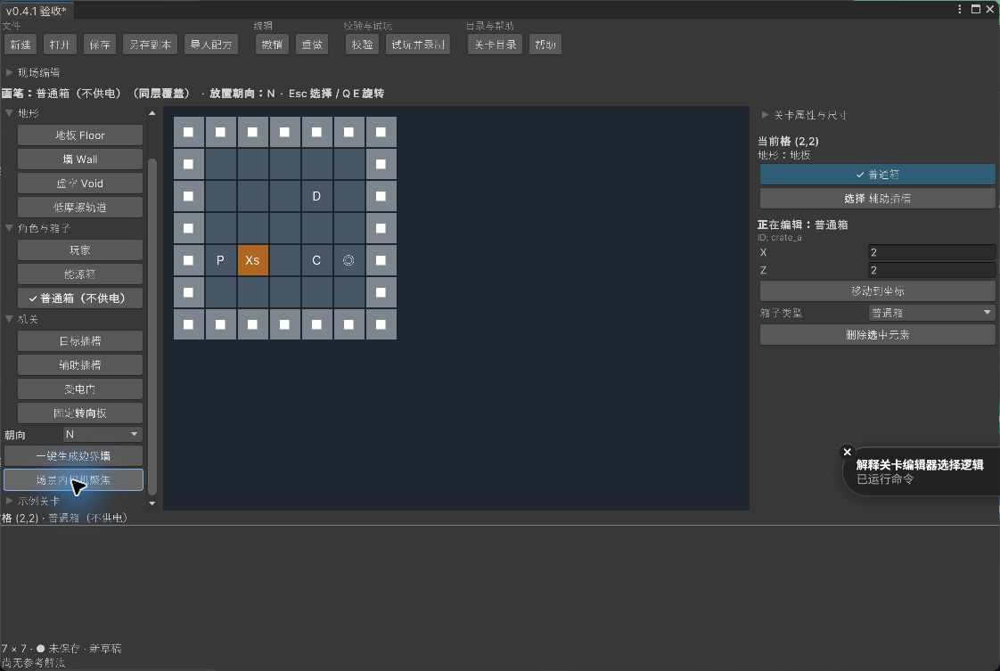
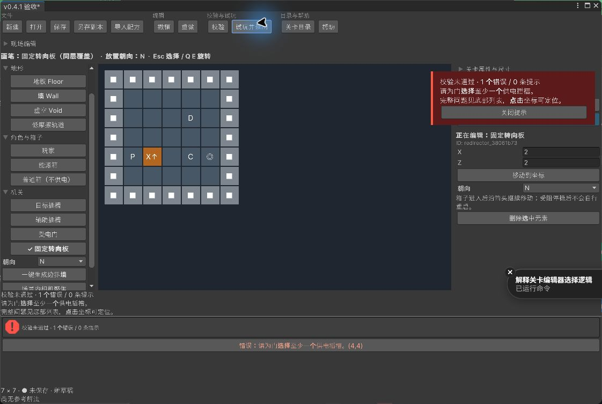

# v0.4.1 · 编辑器入口简化

状态：已完成 · 类型：编辑器 / 作者工具 · 实施起始提交：`08c4797`。

用户在本次请求中明确指定 v0.4.1。该编号已有 [UI 简化规划的已完成记录](V0.4.1.md)（提交 `2da9fc8`）；本次按用户指定追加实现，保留原规划历史，v0.6.0 的三项文案移除范围不在本轮实施。

## 目标与范围

- 删除作者窗口的手动“回放解法”按钮及执行入口，清理相应帮助和过期提示。参考解法仍由试玩录制，目录和构建继续自动验证；过期时提示重新试玩通关并录制。
- “外围墙”改为“一键生成边界墙”；“SceneView 聚焦”改为“场景内相机聚焦”，行为保持。
- 删除擦除画笔、擦除层选择、右键擦除及相关提示。保留属性栏针对选中对象的删除操作和地形画笔。
- 补齐放置覆盖：同层对象替换，箱子与插槽等跨层合法叠放保留；同类箱子/插槽/门/转向板原位更新并保持 ID，插槽身份切换不破坏门引用；不同机关替换移除旧插槽引用。非法放置先检查后修改，失败保留原布局。
- 保留选择、拖刷、撤销/重做、草稿、保存、作者试玩和现场编辑；旧布局中残留的擦除画笔状态回到选择，不错配其他画笔。

## 验收计划

1. 编译与 Console 检查；作者数据、覆盖与引用、配方/旧版兼容、UI 入口与右键无修改、撤销重做、保存恢复及现场编辑相关测试。
2. 实际窗口检查两个新文案和被删除入口；箱子/插槽同格覆盖、机关替换、原位 ID、错误反馈与保存重开。
3. 文档与当前行为一致，检查链接、差异和用户草稿/既有未提交改动；只提交本轮文件。

## 执行结果与限制

- 已完成计划登记，从 `08c4797` 开始本次追加实现；原 v0.4.1 文档规划记录保留。
- 已移除手动回放、擦除画笔、擦除层与右键擦除；两处按钮已改名。同层覆盖保留原位身份及合法叠放，机关替换会清理已移除插槽的供电引用，撤销可恢复。
- Unity 2022.3.51f1 经 stdio MCP 编译完成，Console 错误为 0。项目 EditMode **149/149 通过**，包含作者操作、UI 输入、撤销重做、配方、保存恢复及进入 Play Mode 的现场编辑用例。首次测试中一条旧断言仍要求拒绝机关覆盖，已改为验证覆盖和撤销恢复，最终整组通过。结果摘要见 [Verification.json](V0.4.1Validation/Verification.json)。
- 实际窗口使用独立 7×7 临时关卡完成：生成边界墙；普通箱覆盖能源箱并保留插槽与 ID；撤销/重做；右键无修改；转向板替换插槽并保留箱子；直接试玩显示缺少供电来源的侧边错误及底部列表；撤销恢复连接。“场景内相机聚焦”将 Scene 相机对准 `(3,0,3)`，取景尺寸为 `4.2`。
- 临时文件保存、重新载入后内容哈希一致，箱型、对象 ID、插槽和供电引用均保留。验收窗口已关闭，Bootstrap 保持未修改，验收期间的作者 `Current.json` 字节不变；原作者草稿备份保留在本地 `Logs/V0.4.1/Before/`。
- `self_test.json`、正式目录、机器人源文件、GM Prefab 与既有项目设置的六项指纹未变；第三方导入与原有未提交变更不纳入本轮提交。操作指南、GDD、实现状态、路线图及台账同步当前行为。
- 8 份 Markdown 的 178 个本地链接/锚点、验收 JSON 解析及本轮差异检查完成；除已知的课程 PPT 缺失链接外，无新增失效链接。
- 本轮未另跑完整 PlayMode 套件或 Player 构建：修改集中在作者工具与过期提示，相关现场生命周期已由上述 EditMode 集成用例覆盖；完整交付仍按 v0.9.0 排期。已有课程 PPT 的失效导航链接沿用 v0.4.2 记录，不恢复用户删除的文件。

