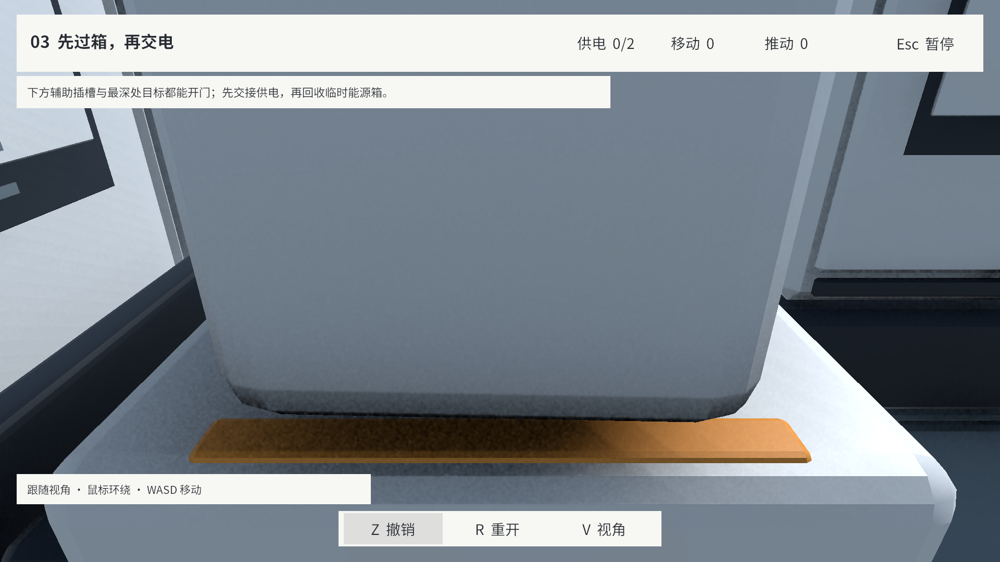
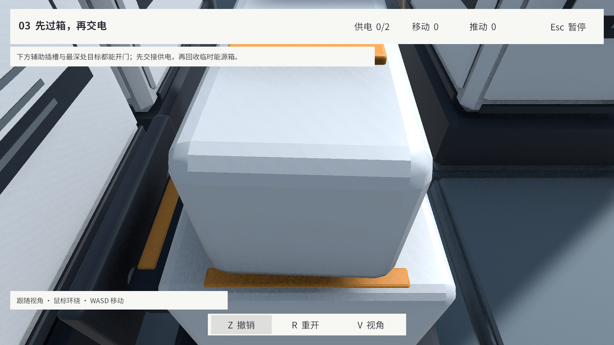
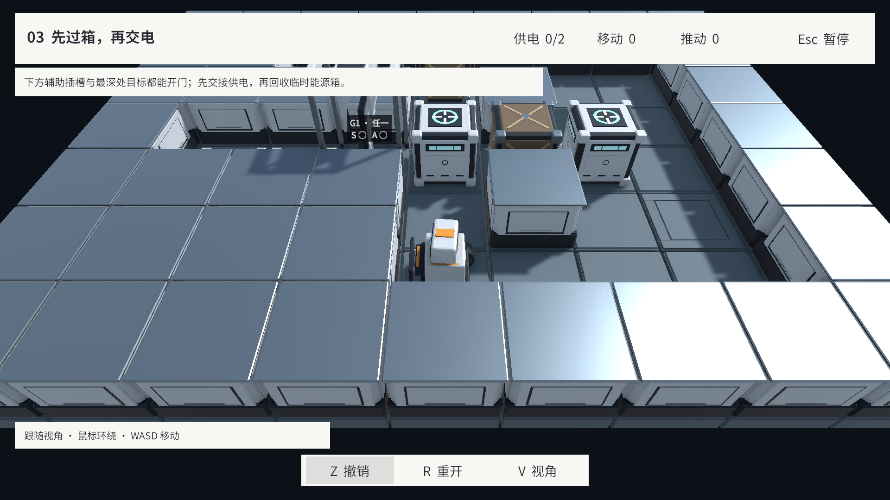
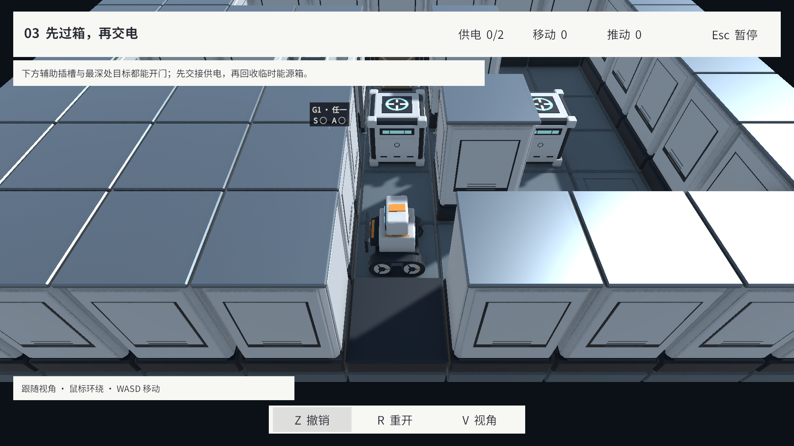

# v0.5.0 验收记录

状态：已完成本版实现与约定检查，验证方式及边界见下文。日期：2026-09-17–18（America/New_York）。Unity 2022.3.51f1、URP 14、Cinemachine 2.10.7；起始提交 `0b07ec9`。本版只调整镜头与表现，不修改正式关卡或解法规则。

## 镜头方案比较

在 L06 初始局面、1920×1080、yaw=90° 对比。每张图均为实际 Game View，局面和镜头方向相同。

| 方案 | 观察 | 取舍 |
| --- | --- | --- |
| 原参数：25°、3.2 m | 邻墙避障将镜头挤到机器人身上 | 修改基线 |
| A：48°、4.8 m | 仍被原高墙碰撞盒挤近 | 调参不足以解决贴墙问题 |
| B：A + 全部墙上层 Y 缩放 0.45、碰撞高 0.7 m | 能拉远，但前景仍遮挡机器人下半身，改变全部墙的比例 | 未采用 |
| C：A + 局部隐藏遮挡墙上层、保留 0.24 m 基座代理 | 机器人完整可见，其余墙体保持体积 | 采用；实现另覆盖相邻操作格与门上层，并增加恢复延迟 |

## 自动与实际检查

| 检查 | 结果 | 证据 |
| --- | --- | --- |
| 项目 EditMode | 149/149，包含正式目录和参考解法 | [汇总](EditMode.json)，原始 XML：`Logs/V0.5.0/EditMode-149.xml` |
| 完整项目 PlayMode | 52/52，包含九关连续通关、UI、GM、动作取消、角色与机关 | [汇总](PlayMode.json)，原始 XML：`Logs/V0.5.0/PlayMode-52.xml` |
| 投影修正后的相机/动作专项 | 22/22，含新增的过渡末切投影与连续反向切换 | [汇总](CameraPlayMode.json)，原始 XML：`Logs/V0.5.0/CameraPlayMode-22.xml` |
| 720p 图形加粗后的表现专项 | 10/10，含多来源/一源多门、断电占据、交接、撤销和重建释放 | [汇总](VisualPlayMode.json)，原始 XML：`Logs/V0.5.0/VisualPlayMode-10.xml` |
| 最终编译和 Console | 无编译错误、Console 零错误 | [记录](Console.json) |
| Windows 非开发版构建 | 成功，0 错误/0 警告 | [构建结果](Build.json)、[显式入口请求](BuildRequest.json) |
| 独立 Player | 鼠标开始游戏和 HUD 切镜头通过；Input System V/V/Esc/Esc 事件检查通过 | [检查与边界](PlayerValidation.json)、[临时验证脚本](StandaloneInputCheck.cs.txt) |

完整 PlayMode 后补一项投影时点测试，最终项目共有 53 项 PlayMode 用例；后两次为受影响用例复测，不把 52+22+10 相加为独立用例数。所有自动检查均为本轮运行。正式 JSON、解法、主题资源、模型/材质源资产及 GUID 保持不变。

[文件与链接检查](Verification.json) 核对测试汇总与原始 XML、图片尺寸、新增 GUID 和版本状态。文档索引原有课程 PPT 链接因工作区已删除该文件而失效，保留该既有删除。

## 画面与连续操作

- [L12 默认俯视全图，1080p](L12Top1080.png)：双连接目标、门状态和转向板不被文字遮盖，棋盘位于 HUD 净空区。
- [L06 第三人称贴墙，1080p](L06Third1080.png)：同一出生点及 90° 机位，保留机器人全身与相邻操作格。
- [复杂连接夹具，1080p](Connections1080.png)、[720p](Connections720.png)、[720p 灰阶](ConnectionsGray720.png)、[第三人称](ConnectionsThird720.png)：三门同时覆盖 Any 已供电开启、All 部分供电关闭和普通箱占据的断电保开；能源箱覆盖目标及双连接来源，角标与分段仍露出。纯目标不画插头。夹具是临时运行数据，不是新增正式关卡；[可复现定义](VisualFixture.cs.txt)。
- [独立 Player 默认俯视](PlayerTop.jpg)、[鼠标切换第三人称](PlayerThird.jpg)：原生 Windows 窗口截图，游戏渲染分辨率 1280×720；截图受桌面 DPI 缩放。
- 灰阶来自临时 URP Color Adjustments 饱和度 -100 的实际渲染，未修改截图内容。检查后退出 Play Mode，临时 Volume 未写入场景。

演示为实际 Game View 的 150 次连续采样，约 15.43 秒，以 10 fps 编码；播放 L06 前 26 条合法参考命令，覆盖贴墙、转角、窄门和推动，机位随路径环绕。第 65、80 帧切镜头时表现动作均未结束，原始采样计时和命令见 [记录](CameraRoute.json)。不是完整关卡通关录像；完整解法由自动回归验证。

## 构建入口与验证边界

- 正常验收包：`Builds/V0.5.0/Windows/Sokoban.exe`。首次按默认 Build Settings 构建进入空 SampleScene，随后改为本次调用显式指定 Bootstrap，重新构建并验证主菜单与游玩。现有 Build Settings 配置保留，重新构建应显式提供 `Assets/Scenes/Bootstrap.unity`；标准入口统一属于最终交付收尾。
- 原生 Windows 自动化的 V/Esc 注入没有产生观察到的 V 控件按下事件，不能据此声称完成物理键盘人工验证。独立诊断包保持相同游戏代码，通过 Input System 排队 0.1 秒按键状态，实际运行 LevelRunner 输入处理；V 双向切换、投影、Cursor 锁定/释放、Esc 暂停恢复、同一会话和零计数全部符合预期。物理键盘确认尚未收到，原生日志位于 `Logs/V0.5.0/Player.log` 和 `StandaloneInputCheck.log`。
- 诊断脚本只在独立验证包临时编译，已从 Assets 删除；正常验收包构建于加入诊断脚本之前。测试后的 Bootstrap 保持原路径、非 Play Mode、无未保存改动。原有美术源、GM Prefab、设置变更和第三方导入未纳入本轮提交。
- 超大自定义连接网络的图形分段密度仍需单独评估。本轮不代替 v0.9.0 的整体玩家流程、进度持久化和性能验收，也不把 Agent 的看图判断当作独立玩家易用性评审。
