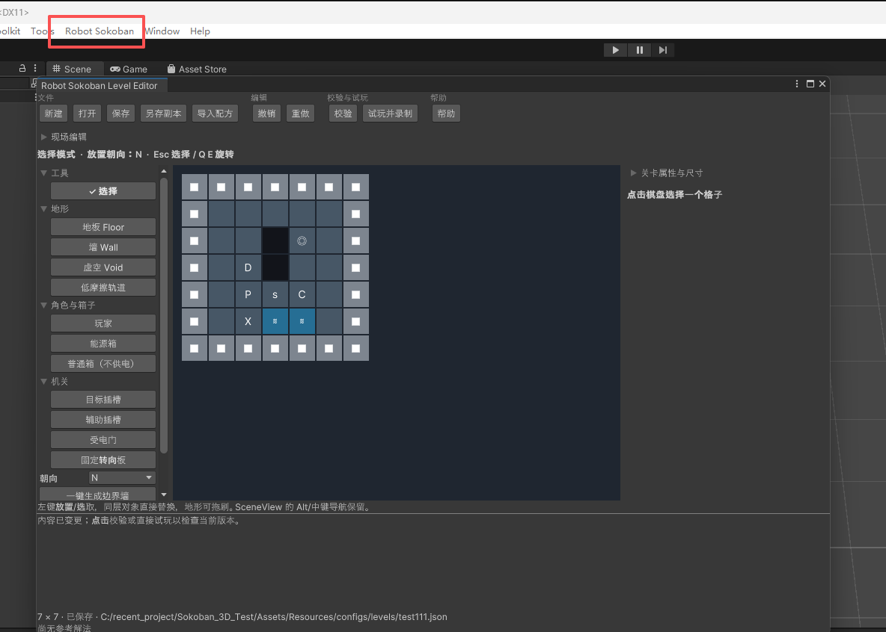
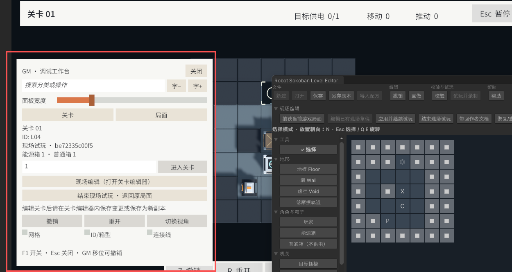

# Robot Sokoban

玩家操控维修机器人，将能源箱推入目标插槽即可通关。一些通电插槽（可能是目标插槽）可以控制场景内的门，能源箱子需要在临时开路和最终目标之间调配；加上无通电效果的木箱、低摩擦轨道与固定转向板进一步构成空间和运输谜题。所有能源箱都进入目标插槽即通关。

当前正式流程包含 **7 关**（L04 → L06 → L07 → L08 → L10 → L11 → L12），支持选关、连续闯关、撤销、重开、双视角、暂停、结算、设置，以及本地进度和最佳成绩保存。配套 Unity 关卡编辑器、GM 面板和 Play Mode 现场编辑，支持从制作、试玩到修改验证的完整工作流程。

## 开发工具
* 引擎：Unity 2022.3.51f1
* DCC软件：Blender 5.2.2
* IDE：Rider + VS Code
* AI Agent工具：Codex为主，包含Blender MCP建模/材质/动画+工作流搭建+开发实现，Claude Code辅助做debug和简单review

## 运行与操作

1. 项目引擎版本为**Unity 2022.3.51f1**。
2. 打开 `Assets/Scenes/Bootstrap.unity`，点击 Play 即可体验游戏。

| 操作 | 按键 / 方式 |
| --- | --- |
| 移动与推动 | WASD 按镜头方向移动；方向键按世界方向移动 |
| 切换视角 | V：默认俯视与第三人称切换 |
| 调整镜头 | 第三人称下鼠标环绕；滚轮缩放 |
| 撤销 / 重开 | Z / R；撤销会恢复整次推动、滑行与供电变化 |
| 暂停 | Esc |
| 调试面板 | F1，仅 Unity Play Mode / Development Build |

选关页面默认开放所有关卡；完成后可进入下一关，末关结算后可重玩或返回选关。

## 关卡编辑器与 GM

### 制作、试玩与加入正式目录

1. 在Unity Editor顶部菜单栏打开 **Robot Sokoban > Level Editor**，点击“新建”，或从“示例关卡”打开已有地图。新图默认 9×9，可调整尺寸、生成边界墙。

2. 在关卡编辑器中间显示的二维关卡中可自由编辑各类关卡元素。右侧修改所选对象的属性；门可以选择供电插槽及 Any / All 条件，转向板可以设置方向。坐标从左下角 `(0,0)` 开始，X 向东、Z 向北。
3. 点击“校验”，可点击问题定位格子；Ctrl+Z / Ctrl+Y 撤销重做，Ctrl+S 保存。同层放置会覆盖原对象，删除使用“删除选中元素”。校验只保证关卡结构逻辑不出错，不保证有解。
4. 点击“试玩并录制”，可以直接进入Play Mode试玩当前关卡，试玩关卡通关后可以在菜单内选择保存这一轮的操作为参考解法。
5. 在 Project 中选择 `Assets/Resources/configs/CampaignCatalog.asset`，通过 Inspector 的 **Levels** 列表添加已保存的关卡 JSON 并调整顺序。构建前会自动检查目录、资源和参考解法，缺失或过期的解法会阻止构建。

### GM 与现场编辑

- 在Unity Editor下游戏运行时按 **F1** 可以打开一个运行时 GM 页面。“关卡”页可按正式目录序号跳关；“局面”页在面板外点选玩家或箱子，填写目标 X/Z，再点“移动到此格”。移动可以撤销，非法落点会被拒绝。
- 底部提供撤销、重开、视角切换，以及网格、ID/箱型、连接线显示。可拖动面板、调整宽度和字号；Esc 或“关闭”收起。GM 实际移位后不能保存正式成绩或原关卡参考解法，全部撤销或普通关卡重开可恢复资格。
- GM“关卡”页点“现场编辑（打开关卡编辑器）”→ 修改自动打开的现场草稿 →“应用并继续试玩”→“结束现场试玩”恢复捕获前的局面。运行时现场修改后支持即时保存落盘，也可以直接全部撤销。现场模式下 Ctrl+S 只备份临时草稿；要持久化为关卡，使用“另存为副本”，或“带回作者文档”后在作者模式保存。应用现场修改不会自动覆盖原关卡文件。

完整操作见 [关卡编辑器与 GM 指南](Docs/Editor/LevelEditorGuide.md)。

## 三天开发安排

下表按主体开发的主要交付阶段归纳，期间有交叉迭代；工程初始化、依赖核对和机器人资产准备可从前期提交追溯。

| 时间 | 工作分配 | 阶段产出 |
| --- | --- | --- |
| 第 1 天：最小原型MVP开发 | 明确基础规则与数据结构；实现基础3C，基础机制和操作栈逻辑；基础主角美术资产生产；完成编辑器的建图、保存、校验、试玩；串联菜单和关卡，运行时GM页面原型并接入基础美术 | 从编辑器制作关卡，到游戏通关、返回修改的流程可用 |
| 第 2 天前半：基于版本的路线规划 | 验收后列出原型版本的迭代方向和不足，和Agent讨论得出细化的版本规划并形成规划文档 | 详细的版本[路线图/规划文档](Docs/Versions/Roadmap.md) |
| 第 2 天后半：内容铺量与易用性 | 场景美术资产生产；加入固定转向板和运输谜题；扩充并调整关卡；打磨门与插槽的视觉关系和表现、编辑器选择/覆盖交互、目录与构建校验；调整俯视和第三人称镜头 | 批量生产关卡和美术资产内容，改善观察与操作体验 |
| 第 3 天：体验与收尾 | 简化 UI，修复导航反馈；保存进度与成绩；合入基础音效；按试玩反馈调整关卡和镜头、精简 GM 与废弃工具；执行回归、Windows 构建及实机检查 | 关卡，美术和3C最终调整，完成 v0.8.0 收尾与验收记录 |

### 使用的工具

| 工具 | 在项目中的用途 |
| --- | --- |
| Unity 2022.3.51f1 / C# / URP 14.0.11 / Cinemachine / DOTween / Rider / VSCode | 引擎和IDE基建 |
| 自制开源框架 [KToolkit](https://github.com/cortexA233/KToolkit_for_unity) / UGUI | UI系统与页面管理，事件系统，其余小工具等 |
| Codex，Claude Code，各类文档与项目 Skills | Codex主力开发，Claude Code辅助Debug和review，项目专用Skill用于稳定固化开发流程，如遵循版本排期，规范化需求细化，拆分和实现等 |
| CoplayDev MCP for Unity 10.2.0 / PowerShell | 连接 Unity，操作场景与资源、检查 Console、运行测试和构建；命令行脚本补充自动化入口 |
| Blender + MCP / Python | 美术资产生产；Python 另用于生成 8 个基础音效 |
| GPT ImageGen | 探索 UI 风格与组件布局，生成最终UI图 |
| Git / Unity Test Runner | 隔离任务、保存版本与合并；执行自动化测试 |

### 任务规划与编排

1. **先定义可验收的范围。** 由人工确定玩法方向、视觉取舍与试玩反馈，Codex 辅助细化和实现；优先完成关卡编辑器及完整游玩流程，再扩展内容和表现。[GDD](Docs/Gameplay/GameDesign.md) 统一规则、数据与模块接口。
2. **按依赖拆任务，按版本追踪。** 规则与数据先行，编辑器和游戏共用规则内核，动画与音效消费规则结果。后续需求在 [路线图](Docs/Versions/Roadmap.md) 中编号，再分配版本、范围、依赖和验收项；变更与取消保留记录，避免把历史设想当作当前功能。
3. **独立模块隔离开发，再合并验证。** 游戏、工具、UI、美术和音频分别组织任务；例如音效曾在独立 Git 工作树实施，与 UI/存档工作分开，合并时处理冲突并补做组合回归。美术通过 FBX、Prefab、命名与挂点约定接入。
4. **每轮形成可检查的结果。** 实现后检查编译和 Console，运行受影响测试，再按改动检查实际界面或构建；失败则修复复验。计划、验证记录与带版本前缀的聚焦提交共同保留开发依据。

## 验证与资料

最近的 [v0.8.0 收尾验收](Docs/Versions/V0.8.0Validation/README.md) 记录了详细的收尾测试记录。

当前交付包含基础音效；BGM、独立音量等扩展未纳入本次收尾。历史方案与各轮验证边界保留在 [版本台账](Docs/Versions/README.md)，构建产物在本机生成，不随仓库提交。

- [文档索引](Docs/README.md)：玩法、UI、编辑器、美术、工程说明与开发历史。
- [规则与实现设计](Docs/Gameplay/GameDesign.md) · [UI 实现](Docs/UI/UIImplementation.md) · [依赖说明](Docs/Engineering/UnitySetup.md)。
- [机器人源文件与动画](ArtSource/Robot/README.md) · [空间站资产](ArtSource/StationKit/README.md) · [音效来源](Docs/Audio/Sfx.md)。

代码位于 `Assets/Scripts/`，关卡与运行时资源位于 `Assets/Resources/`，场景位于 `Assets/Scenes/`；可编辑美术源文件和导出脚本位于 `ArtSource/`，策划与验证记录位于 `Docs/`，外部脚本位于 `Tools/`。
